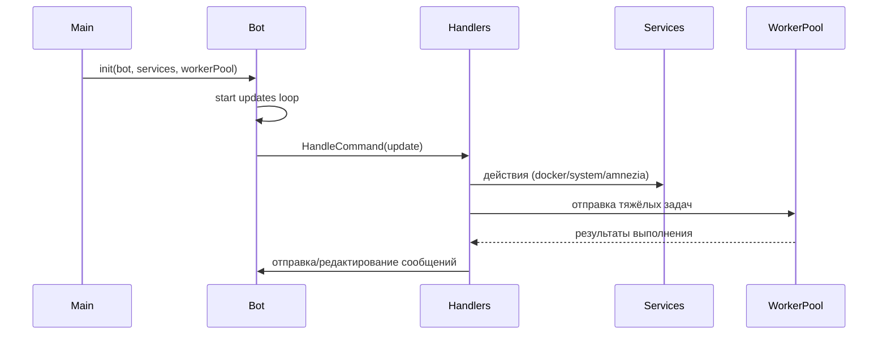
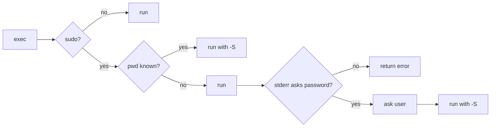

# Документация разработчика Telegram Server Bot

Этот документ подробно описывает архитектуру, модули и ключевые потоки выполнения. Все названия пакетов/файлов приведены по состоянию текущего репозитория.

## Обзор архитектуры

Компоненты:

- `cmd/bot/main.go` — точка входа, загрузка конфига, инициализация сервисов, запуск бота/systemd-мониторинга
- `internal/bot/` — инициализация Telegram API, цикл обработки обновлений
- `internal/handlers/` — весь UI/UX Telegram (меню, кнопки, тексты)
- `internal/services/` — доменные сервисы: `system`, `docker`, `amnezia`, `monitoring`
- `internal/cmdrunner/` — надёжный запуск внешних команд (таймауты, ретраи, sudo)
- `internal/workerpool/` — пул воркеров для асинхронных задач
- `pkg/config/` — типизированная конфигурация с загрузкой из Viper
- `pkg/logger/` — структурированное логирование с маскированием чувствительных данных

Высокоуровневый поток:

## Конфигурация

- Загрузка: `main.go:initConfig()` — `CONFIG_PATH` (если задан) либо локальный `config.yaml`. Типизация — `pkg/config/config.go`.
- Ключевые разделы: `bot`, `monitoring`, `docker`, `cmdrunner`, `workerpool`.

## Логирование

- `pkg/logger` — JSON-логи, уровни, маскирование конфиденциальной информации, `traceId` из `internal/context`.

## Бот и обработчики

- `internal/bot/bot.go` — инициализация `tgbotapi.BotAPI`, фильтрация чатов, делегирование в `handlers.CommandHandler`.
- `internal/handlers/command_handler.go` — основной контроллер UI:
  - Разделение на специализированные обработчики: меню навигации, контейнеры, сервисы, система, Amnezia
  - Построение клавиатур (через хелперы), редактирование вместо новых сообщений
  - Пагинация списков (контейнеры/сервисы/WG-клиенты)
  - Навигационный стек: `navStack`/`currentView` для кнопки «Назад»
  - «Длинные» ответы — отправка файлом
  - Markdown-экранирование чувствительных фрагментов

### Хелперы сообщений

- `internal/handlers/msg_helpers.go`:
  - `sendSimpleMessage*`, `sendEditMessageWithKeyboard`, `sendActionResponse`
  - `createBackKeyboard`, `createConfirmationKeyboard`, `createServiceKeyboard`
  - Пагинация: `defaultPageSize`, `paginate`, `InlineItem`, `makeItemRows`, `createPaginationKeyboard`
  - `escapeMarkdownBasic` — базовое экранирование Markdown

## Сервисы

### System (`internal/services/system`)

- Сбор статуса (CPU/RAM/Disk), reboot/shutdown, операции с systemd
- Сервис статусов возвращает агрегированные строки, пригодные для Telegram

### Docker (`internal/services/docker`)

- Операции над контейнерами: список, статус, старт/стоп/перезапуск, логи
- Вызовы через `cmdrunner` с таймаутами/retry

### Amnezia (`internal/services/amnezia`)

- WireGuard: список/создание/удаление клиентов, резервное копирование и откат файлов, перезапуск WG

### Monitoring (`internal/services/monitoring`)

- Периодическая проверка метрик, нотификации в чат при превышении порогов

## Пул воркеров (`internal/workerpool`)

- Очередь задач, фоновые горутины, таймауты на задачу, возврат результата через канал
- Применение: длительные системы команд (docker/systemd), операции создания/удаления клиентов

## Запуск внешних команд (`internal/cmdrunner/runner.go`)

- `RunWithRetries(ctx, parts, opts)`
  - Таймаут, несколько попыток, запись stdout/stderr
  - Ввод sudo-пароля по требованию: если `sudo` действительно запросил пароль, только тогда бот запрашивает его у пользователя и повторяет команду через `sudo -S`
  - Источники пароля (по приоритету): `opts.Password` → `ENV SUDO_PASSWORD` → `viper cmdrunner.sudo_password` → Telegram-запрос

## Навигация и UI-паттерны

- Всегда редактировать существующее сообщение при обработке callback
- Единая кнопка «Назад» (`nav_back`) со стеком
- Длинные выводы отправлять файлом, а не обрезать
- Для экранов статуса — кнопка «🔄 Обновить», если применимо

## Сборка и деплой

- `build.sh` — сборка в `releases/server-bot-linux-amd64`
- `deploy.sh` — копирование бинарника/конфига/unit-файла, `systemctl daemon-reload && start`
- systemd unit:
  - `ExecStart=/usr/local/bin/server-bot`
  - `WorkingDirectory=/opt/telegram-bot`
  - `Environment=CONFIG_PATH=/etc/server-bot.yaml`

## Рекомендации по развитию

- Вынести callback-префиксы в константы
- Добавить Prometheus-метрики и алертинг
- Ввести модульные интерфейсы для сервисов для удобного мокирования
- Разнести `command_handler.go` по доменам (containers/services/system/amnezia)

