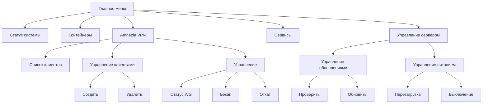

# Руководство пользователя Telegram Server Bot

Документ объясняет, как пользоваться ботом и как настроить конфигурацию. Вся информация относится только к аспектам работы с ботом.

## Возможности

- Просмотр статуса системы (CPU, RAM, HDD) — в одном экране
- Управление контейнерами Docker (старт/стоп/перезапуск/логи/статус)
- Просмотр и управление systemd-сервисами
- Управление сервером: питание (перезагрузка/выключение) и обновления (проверка/установка)
- Управление Amnezia VPN (WireGuard): список клиентов, создание/удаление, статус, резервное копирование, откат
- Уведомления мониторинга при превышении порогов (CPU, диск)

## Как начать

1. Установите и запустите бота на сервере (администратор сервера делает это один раз).
2. Откройте диалог с вашим ботом в Telegram и отправьте `/start`.
3. Используйте меню, отображаемое под сообщением, для навигации.

## Структура меню

Главное меню:

- 📊 Статус системы — показывает сводный экран (CPU, RAM, HDD)
- 🐳 Контейнеры — список контейнеров с постраничной навигацией
- 🛡️ Amnezia VPN — управление Amnezia/WireGuard
- ⚙️ Сервисы — просмотр активных/неактивных сервисов (с постраничной навигацией)
- 🖥 Управление сервером — раздел на два подменю

Управление сервером:

- ⬆️ Управление обновлениями
  - 🔍 Проверить обновления
  - ⬆️ Обновить систему
- 🔌 Управление питанием
  - 🔄 Перезагрузить сервер
  - 🔌 Выключить сервер

Amnezia VPN:

- 📋 Список клиентов — постраничный список существующих клиентов
- 👥 Управление клиентами — подменю
  - ➕ Создать клиента WireGuard
  - ➖ Удалить клиента WireGuard (с подтверждением)
- 🛠 Управление — подменю
  - 📊 Статус WireGuard (есть кнопка 🔄 Обновить)
  - 💾 Резервное копирование
  - 🔄 Откат конфигурации

Контейнеры (экран контейнера):

- Для запущенных: 🔄 Restart, 🟥 Stop, 📊 Status, 📝 Logs
- Для остановленных: 🟩 Start, 📊 Status, 📝 Logs

Сервисы (экран сервиса):

- Для активных: 🔄 Restart, 🟥 Stop, 📊 Status
- Для неактивных: 🟩 Start, 📊 Status

Навигация:

- Кнопка ⬅️ Назад возвращает на предыдущий экран (используется стек навигации)
- В списках доступна пагинация (◀️, ▶️, индикатор «Стр. X/Y»)

## Уведомления мониторинга

Бот может отправлять уведомления в заданный чат при превышении порогов загрузки CPU и при малом свободном месте на диске.

## Файл конфигурации

Конфиг YAML. По умолчанию ищется `config.yaml` в рабочем каталоге, либо путь задаётся через переменную окружения `CONFIG_PATH`. На сервере используется `/etc/server-bot.yaml` (см. unit-файл systemd).

Пример:

```yaml
bot:
  token: "<TELEGRAM_BOT_TOKEN>"
  allowed_chats: 211114551        # список/или один chat_id, которым разрешен доступ
  update_timeout: 60               # таймаут получения обновлений (сек)

monitoring:
  check_interval: 30               # период опроса (сек)
  cpu_threshold: 90                # порог нагрузки CPU (%)
  disk_threshold: 10               # порог свободного места на диске (%)

docker:
  socket: "/var/run/docker.sock" # путь к сокету Docker
  timeout: 30                      # таймаут команд Docker (сек)

cmdrunner:
  timeout_seconds: 30              # общий таймаут команд
  attempts: 3                      # число попыток при сбоях
  sudo_password: ""               # можно оставить пустым

workerpool:
  workers_count: 5                 # размер пула воркеров
```

Переменные окружения (необязательно):

- `CONFIG_PATH` — абсолютный путь к YAML конфигу
- `SUDO_PASSWORD` — пароль sudo (используется ТОЛЬКО если пароль нужен и отсутствует в конфиге/опциях)

Порядок настройки:

1. Создайте Telegram-бота у `@BotFather`, получите токен и внесите его в `bot.token`.
2. Укажите ID разрешённого чата в `bot.allowed_chats` (получите свой chat_id с помощью любого “get id” бота).
3. При необходимости подстройте `monitoring`, `docker`, `cmdrunner`, `workerpool`.
4. Разместите конфиг на сервере (например, `/etc/server-bot.yaml`) и убедитесь, что unit-файл systemd указывает на него через `Environment=CONFIG_PATH=/etc/server-bot.yaml`.
5. Запустите/перезапустите службу.

## Работа с sudo-паролем

- Команды с `sudo` выполняются без запроса пароля, если он не требуется (NOPASSWD или кеш sudo).
- Если во время выполнения `sudo` действительно запрашивает пароль, бот попросит ввести пароль у пользователя и повторит команду.
- Также пароль может быть задан через `SUDO_PASSWORD` или `cmdrunner.sudo_password`.

## Подсказки по интерфейсу

- Длинные выводы (логи/статусы) бот отправляет как файл `.txt`.
- Многие экраны поддерживают кнопку «🔄 Обновить».

## Схема меню (упрощённо)




