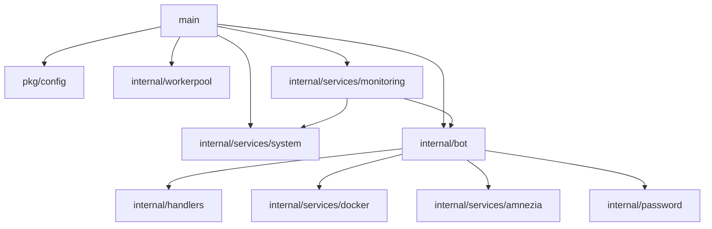

# Модуль: cmd/bot/main.go

## Описание

Точка входа приложения. Отвечает за инициализацию всех компонентов системы, загрузку конфигурации, запуск сервисов и обработку сигналов завершения.

## Структура

```go
func main()
func initConfig() error
func createDefaultConfig() error
```

## Принцип работы

### Инициализация

1. **Загрузка конфигурации** (`initConfig`)
   - Проверяет переменную окружения `CONFIG_PATH`
   - Если задана — использует указанный файл
   - Иначе ищет `config.yaml` в текущей директории
   - При отсутствии файла создаёт конфиг с дефолтными значениями

2. **Создание компонентов** (в порядке инициализации):
   - `workerpool.New()` — пул воркеров для асинхронных задач
   - `system.NewMonitor()` — системный мониторинг
   - `bot.NewBot()` — Telegram Bot API клиент
   - `monitoring.NewService()` — сервис периодического мониторинга

3. **Запуск сервисов**:
   - `monitoringService.Start()` — запускает фоновую горутину мониторинга
   - `b.Start()` — запускает цикл обработки обновлений Telegram (в отдельной горутине)

### Graceful Shutdown

При получении сигнала `SIGINT` или `SIGTERM`:

1. Останавливает сервис мониторинга (`monitoringService.Stop()`)
2. Останавливает бота (`b.Stop()`) с таймаутом 30 секунд
3. Закрывает worker pool (`defer workerPool.Close()`)

## Взаимодействие с другими модулями



## Зависимости

- `pkg/config` — загрузка конфигурации
- `pkg/logger` — структурированное логирование
- `internal/bot` — Telegram Bot API
- `internal/workerpool` — пул воркеров
- `internal/services/system` — системный мониторинг
- `internal/services/monitoring` — периодический мониторинг

## Особенности

- Конфигурация может быть задана через переменную окружения `CONFIG_PATH`
- При отсутствии конфига создаётся файл с дефолтными значениями
- Graceful shutdown с таймаутом для корректного завершения всех компонентов
- Все ошибки инициализации логируются и приводят к завершению с кодом 1

