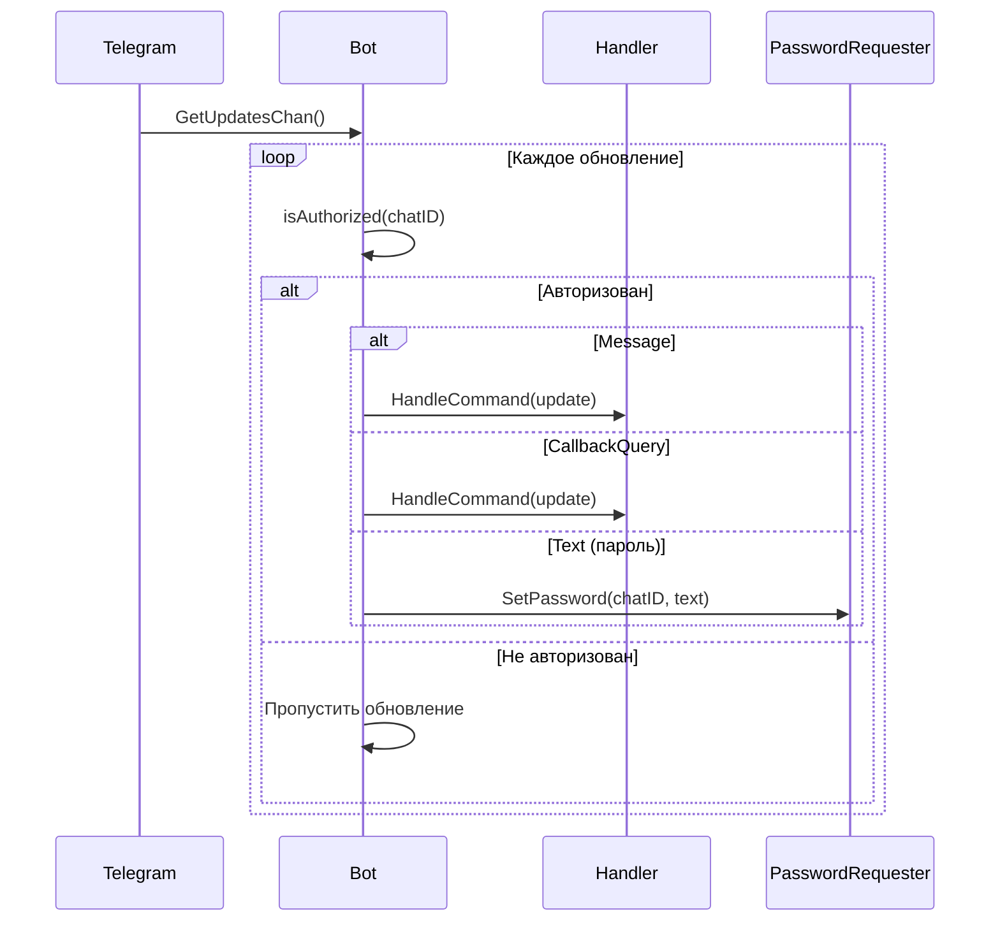
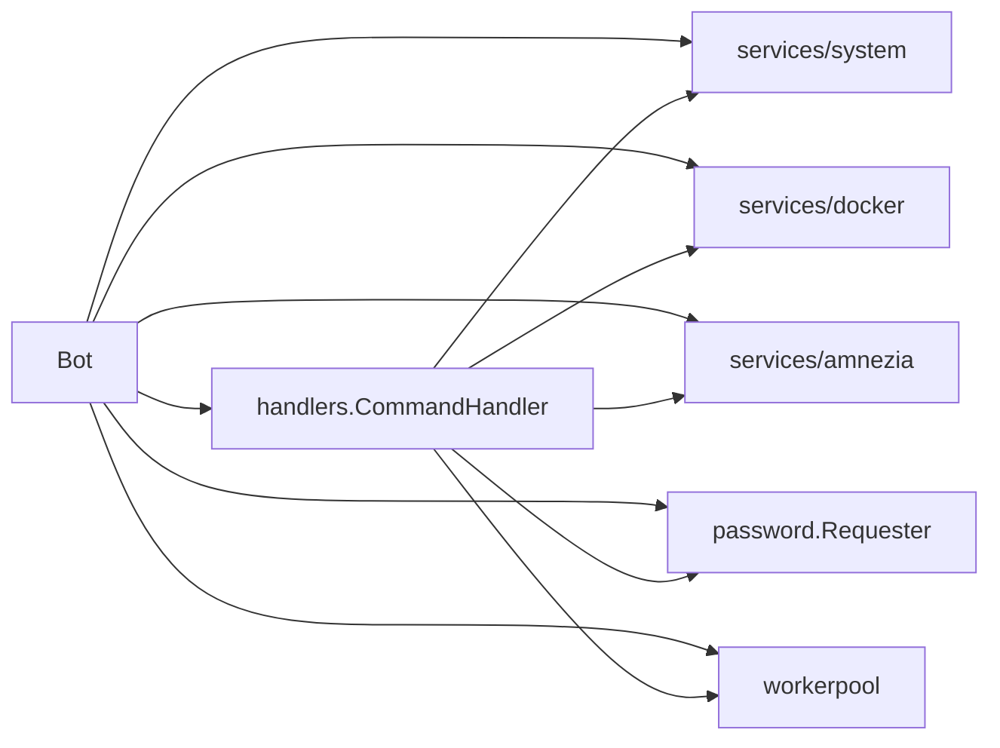

# Модуль: internal/bot

## Описание

Обёртка над Telegram Bot API (`github.com/go-telegram-bot-api/telegram-bot-api`). Отвечает за инициализацию бота, фильтрацию авторизованных пользователей, получение обновлений и делегирование обработки в handlers.

## Структура

```go
type Bot struct {
    api            *tgbotapi.BotAPI
    config         *config.Config
    commandHandler *handlers.CommandHandler
    systemService  *system.Monitor
    dockerService  *docker.Manager
    amneziaService *amnezia.Service
    workerPool     *workerpool.WorkerPool
    passwordRequester *password.Requester
}

func NewBot(cfg *config.Config, workerPool *workerpool.WorkerPool) (*Bot, error)
func (b *Bot) Start() error
func (b *Bot) Stop()
func (b *Bot) GetAPI() *tgbotapi.BotAPI
func (b *Bot) isAuthorized(chatID int64) bool
func (b *Bot) handleCallback(update tgbotapi.Update)
```

## Принцип работы

### Инициализация (`NewBot`)

1. Создаёт Telegram Bot API клиент с токеном из конфига
2. Инициализирует сервисы:
   - `system.NewMonitor()` — системный мониторинг
   - `docker.NewManager()` — Docker менеджер
   - `amnezia.NewService()` — Amnezia VPN сервис
3. Создаёт `password.Requester` для запроса sudo-паролей через Telegram
4. Создаёт `handlers.CommandHandler` со всеми зависимостями

### Цикл обработки обновлений (`Start`)



### Авторизация (`isAuthorized`)

Проверяет, что `chatID` присутствует в списке `config.Bot.AllowedChats`. Только авторизованные пользователи могут взаимодействовать с ботом.

### Обработка обновлений

- **Message** — текстовые команды (`/start`, `/help` и т.д.)
- **CallbackQuery** — нажатия на inline-кнопки
- **Text сообщения** — могут быть ответом на запрос пароля (обрабатывается через `passwordRequester`)

### Остановка (`Stop`)

Вызывает `b.api.StopReceivingUpdates()` для корректного завершения получения обновлений.

## Взаимодействие с другими модулями



## Зависимости

- `github.com/go-telegram-bot-api/telegram-bot-api` — Telegram Bot API
- `pkg/config` — конфигурация
- `pkg/logger` — логирование
- `internal/handlers` — обработчики команд
- `internal/services/*` — доменные сервисы
- `internal/workerpool` — пул воркеров
- `internal/password` — запрос паролей

## Особенности

- Фильтрация по `allowed_chats` на уровне получения обновлений
- Поддержка запроса паролей через Telegram для sudo-команд
- Все обновления делегируются в `CommandHandler` для единообразной обработки
- Таймаут получения обновлений настраивается через `config.Bot.UpdateTimeout`

