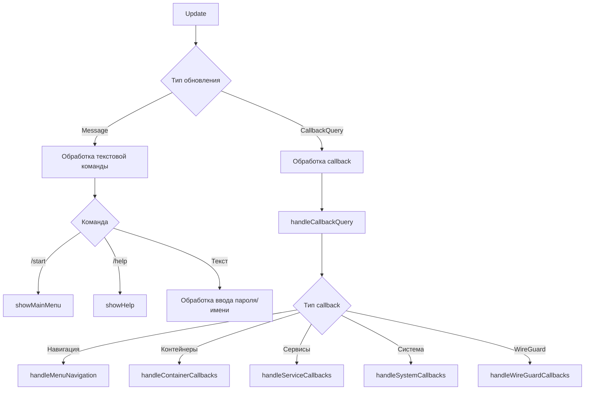
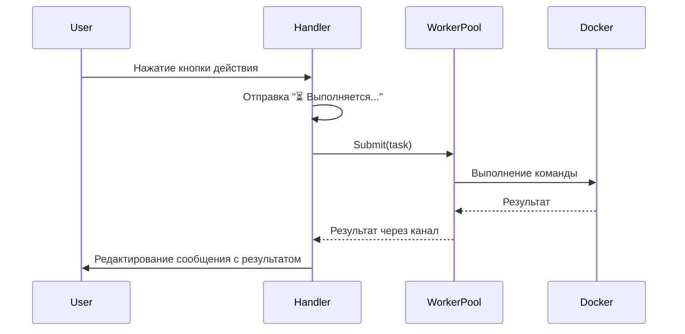
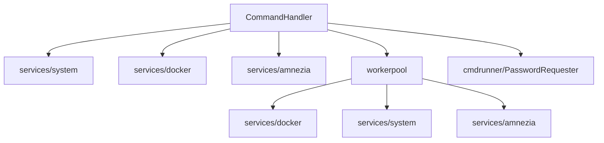

# Модуль: internal/handlers

## Описание

Центральный модуль обработки пользовательских команд и callback-запросов. Отвечает за построение UI (меню, клавиатуры), навигацию, пагинацию и взаимодействие с доменными сервисами.

## Структура файлов

- `command_handler.go` — основной контроллер обработки команд и callback
- `msg_helpers.go` — вспомогательные функции для отправки сообщений и создания клавиатур
- `constants.go` — константы callback-префиксов и лейблов кнопок

## Основные компоненты

### CommandHandler

```go
type CommandHandler struct {
    bot            *tgbotapi.BotAPI
    systemService  *system.Monitor
    dockerService  *docker.Manager
    amneziaService *amnezia.Service
    workerPool     *workerpool.WorkerPool
    passwordRequester cmdrunner.PasswordRequester
    
    // Навигация
    navStack       map[int64][]string  // Стек навигации для каждого чата
    currentView    map[int64]string    // Текущий экран для каждого чата
    pendingInput   map[int64]string    // Ожидание ввода от пользователя
}
```

## Принцип работы

### Обработка команд (`HandleCommand`)



### Навигация

Система навигации использует стек (`navStack`) для отслеживания истории переходов:

- `pushView(chatID, view)` — добавляет текущий экран в стек
- `navigateBack(chatID, messageID)` — возвращает на предыдущий экран из стека
- `currentView[chatID]` — хранит идентификатор текущего экрана

### Пагинация

Универсальная система пагинации для списков:

- `paginate(total, page, pageSize)` — вычисляет границы страницы
- `makeItemRows(items)` — строит ряды кнопок из элементов
- `createPaginationKeyboard()` — создаёт клавиатуру с кнопками пагинации

Размер страницы по умолчанию: **15 элементов**.

### Построение клавиатур

#### Универсальные билдеры

- `buildEntityActionKeyboard(kind, isActive, id)` — клавиатура действий для контейнера/сервиса
- `buildPagedList()` — универсальный постраничный список
- `createBackKeyboard()` — клавиатура с кнопкой "Назад"
- `createConfirmationKeyboard()` — клавиатура подтверждения

#### Специализированные

- `createServiceKeyboard()` — клавиатура управления сервисом
- `createPaginationKeyboard()` — клавиатура с пагинацией

### Обработка действий

#### Контейнеры



#### Сервисы

Аналогично контейнерам, но использует `systemService` для операций с systemd.

#### WireGuard

- Создание клиента — длительная операция через worker pool
- Удаление клиента — с подтверждением через callback
- Статус — прямое выполнение команды в контейнере

### Отложенные ответы (`runWithProgress`)

Для длительных операций:

1. Отправляет сообщение "⏳ Выполняется..."
2. Выполняет операцию в горутине
3. Редактирует сообщение с результатом

### Обработка длинных выводов

Если сообщение превышает 3800 символов:
- Автоматически отправляется как файл `.txt`
- Пользователю отправляется уведомление

## Взаимодействие с другими модулями



## Структура меню

### Главное меню

- 📊 Статус системы
- 🐳 Контейнеры
- 🛡️ Amnezia VPN
- ⚙️ Сервисы
- 🖥 Управление сервером

### Подменю

- **Управление сервером**:
  - Управление обновлениями (проверка/установка)
  - Управление питанием (перезагрузка/выключение)

- **Amnezia VPN**:
  - Список клиентов
  - Управление клиентами (создание/удаление)
  - Управление (статус/бэкап/откат)

## Константы и префиксы

Все callback-префиксы вынесены в `constants.go`:

- `CbBack`, `CbNoop` — навигация
- `CbContainerPrefix`, `CbServicePrefix` — префиксы действий
- `CbRestartPrefix`, `CbStopPrefix`, `CbStartPrefix` — действия
- `LblBack`, `LblRestart`, `LblStop` — лейблы кнопок

## Особенности

- Единообразная обработка всех callback через специализированные функции
- Навигационный стек для корректной работы кнопки "Назад"
- Автоматическая отправка длинных выводов файлом
- Markdown-экранирование чувствительных данных
- Контекстные клавиатуры (показываются только релевантные действия)

