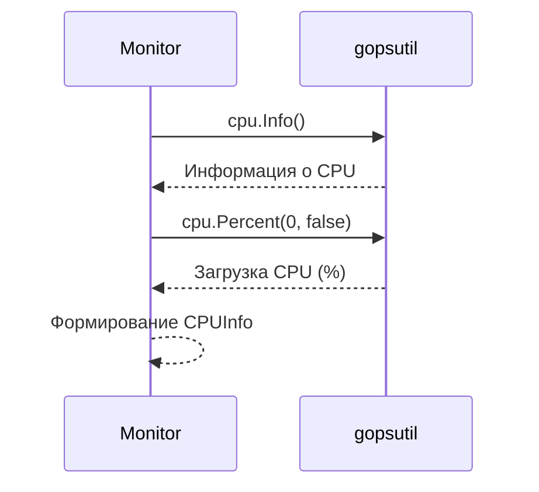
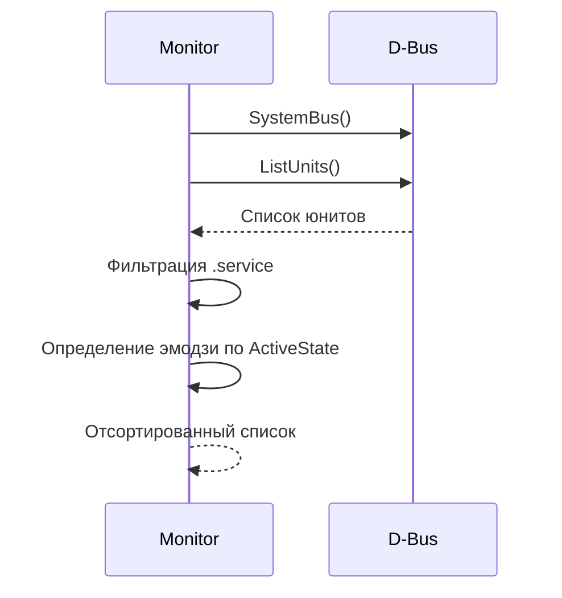
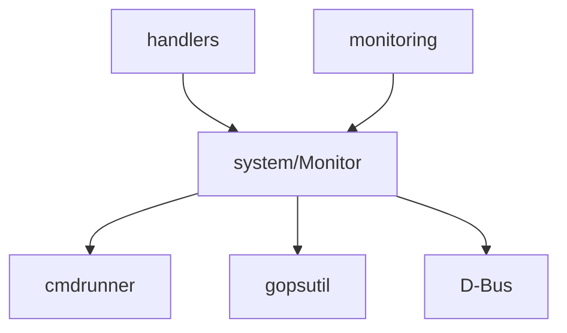

# Модуль: internal/services/system

## Описание

Сервис для мониторинга системных ресурсов (CPU, RAM, Disk) и управления системой (reboot, shutdown, обновления, systemd-сервисы).

## Структура

```go
type Monitor struct{}

type CPUInfo struct {
    Model     string
    Cores     int
    Frequency float64
    Load      float64
}

type MemoryInfo struct {
    Total       float64
    Used        float64
    Free        float64
    UsedPercent float64
    SwapTotal   float64
    SwapUsed    float64
    SwapPercent float64
}

type DiskInfo struct {
    MountPoint  string
    FileSystem  string
    Total       float64
    Used        float64
    Free        float64
    UsedPercent float64
}

type ServiceStatus struct {
    Name   string
    Status string // "active" или "inactive"
    Emoji  string // 🟩 или 🟥
}
```

## Принцип работы

### Мониторинг ресурсов

#### CPU (`GetCPUInfo`)



Использует библиотеку `github.com/shirou/gopsutil/v3/cpu`:
- `cpu.Info()` — модель, количество ядер, частота
- `cpu.Percent()` — текущая загрузка

#### Память (`GetMemoryInfo`)

Использует `github.com/shirou/gopsutil/v3/mem`:
- `mem.VirtualMemory()` — основная память
- `mem.SwapMemory()` — swap

Результаты конвертируются из байт в GB через `bytesToGB()`.

#### Диски (`GetDiskInfo`)

Использует `github.com/shirou/gopsutil/v3/disk`:
- `disk.Partitions()` — список разделов
- `disk.Usage()` — использование каждого раздела

Фильтрует временные файловые системы (`tmpfs`, `devtmpfs`).

### Управление системой

#### Перезагрузка (`Reboot`)

```go
parts := []string{"sudo", "reboot"}
cmdrunner.RunWithRetries(ctx, parts, opts)
```

#### Выключение (`Shutdown`)

```go
parts := []string{"sudo", "shutdown", "-h", "now"}
cmdrunner.RunWithRetries(ctx, parts, opts)
```

#### Обновления (`CheckUpdates`, `UpgradeSystem`)

- `CheckUpdates` — выполняет `apt update` и `apt list --upgradable`
- `UpgradeSystem` — выполняет `apt upgrade -y` с таймаутом 10 минут

### Управление systemd-сервисами

#### Получение списка сервисов (`GetServices`)

**Основной метод** — через D-Bus:



**Fallback метод** — через `systemctl`:
- Выполняет `systemctl list-units --type=service --no-pager`
- Парсит вывод и извлекает имя/статус

#### Статус сервиса (`GetServiceStatus`)

**Основной метод** — через D-Bus:
1. Подключение к системной шине
2. Вызов `GetUnit(serviceName.service)`
3. Получение свойства `ActiveState`

**Fallback метод** — через `systemctl is-active`

## Взаимодействие с другими модулями



## Зависимости

- `github.com/shirou/gopsutil/v3` — системные метрики
- `github.com/godbus/dbus/v5` — управление systemd
- `internal/cmdrunner` — выполнение команд

## Особенности

### Fallback-механизмы

- При недоступности D-Bus используется `systemctl` через cmdrunner
- Все операции с sudo выполняются через `cmdrunner` с поддержкой пароля

### Форматирование данных

- Все размеры конвертируются в GB с округлением до 2 знаков
- Статусы сервисов дополняются эмодзи (🟩 активен, 🟥 неактивен)
- Строковые представления готовы для отображения в Telegram

### Производительность

- D-Bus быстрее, чем вызовы `systemctl`
- Кэширование не используется — данные всегда актуальные
- Операции с дисками могут быть медленными на системах с множеством разделов

## Примеры использования

### Получение статуса системы

```go
cpuInfo, _ := monitor.GetCPUInfo()
memInfo, _ := monitor.GetMemoryInfo()
diskInfos, _ := monitor.GetDiskInfo()
```

### Управление сервисом

```go
status, _ := monitor.GetServiceStatus("nginx")
services, _ := monitor.GetServices()
```

### Системные операции

```go
monitor.Reboot()      // Перезагрузка
monitor.Shutdown()    // Выключение
updates, _ := monitor.CheckUpdates()
monitor.UpgradeSystem() // Обновление системы
```

