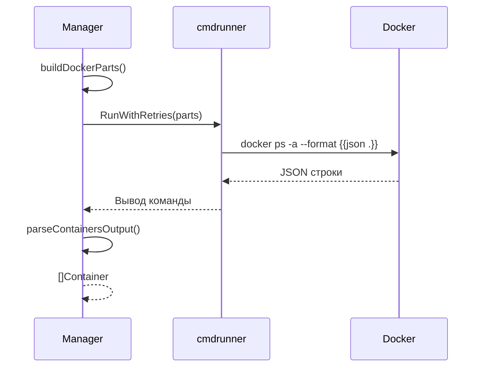
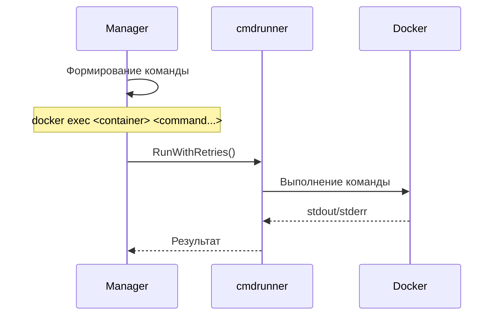
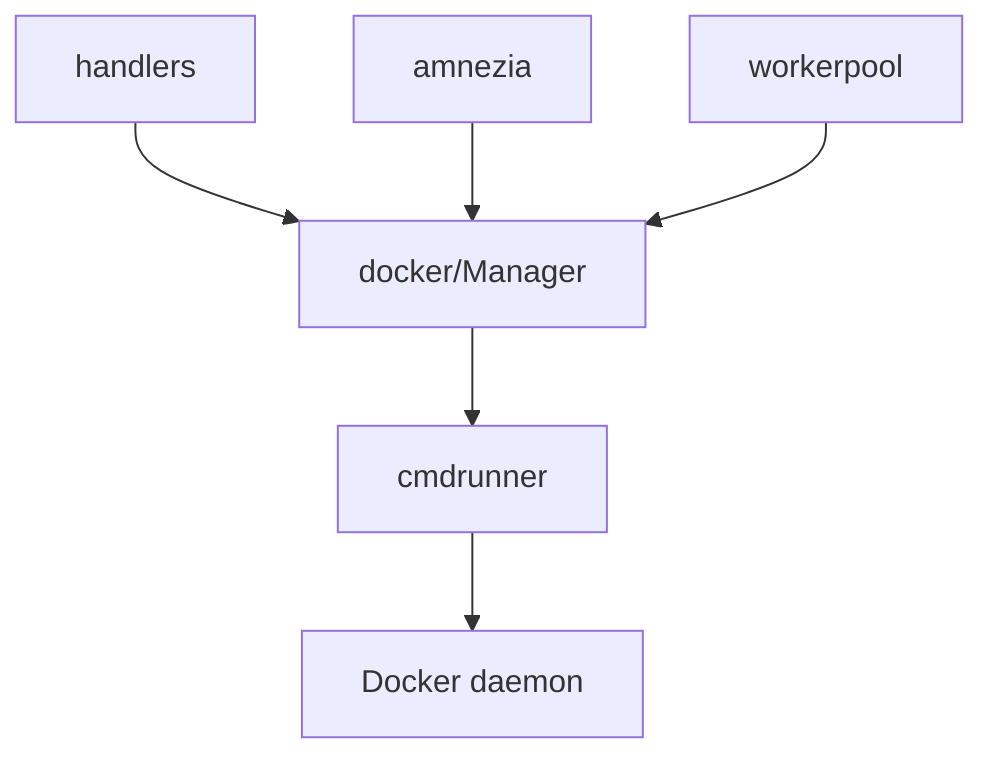

# Модуль: internal/services/docker

## Описание

Сервис для управления Docker-контейнерами: список, статус, запуск/остановка/перезапуск, логи, выполнение команд внутри контейнеров, копирование файлов.

## Структура

```go
type Manager struct {
    socket         string
    timeoutSeconds int
    bin            string
    commandPrefix  []string
}

type Container struct {
    ID      string
    Name    string
    Status  string
    Image   string
    Created time.Time
}
```

## Принцип работы

### Инициализация (`NewManager`)

1. Проверяет и устанавливает значения по умолчанию:
   - `timeoutSeconds` — 10 секунд, если не задан
   - `bin` — "docker", если не задан
2. Выполняет проверку доступности Docker (`docker info`) — не фатальная ошибка
3. Возвращает готовый менеджер

### Список контейнеров (`ListContainers`)



**Формирование команды**:
- Базовые аргументы: `docker ps -a --format {{json .}}`
- Если задан `commandPrefix` (например, `["sudo"]`), добавляется в начало
- Если передан `containerID`, добавляется фильтр `--filter id=<id>`

**Парсинг вывода**:
- Каждая строка — JSON объект
- Извлекаются поля: `ID`, `Names`, `Status`, `Image`, `CreatedAt`
- ID сокращается до 12 символов (как в `docker ps`)

### Операции с контейнерами

#### Запуск (`StartContainer`)

```go
parts := []string{"docker", "start", id}
// + commandPrefix если задан
```

#### Остановка (`StopContainer`)

```go
parts := []string{"docker", "stop", id}
```

#### Перезапуск (`RestartContainer`)

```go
parts := []string{"docker", "restart", id}
// Таймаут увеличен до 60 секунд
```

### Логи (`GetContainerLogs`)

```go
parts := []string{"docker", "logs", "--tail", fmt.Sprintf("%d", lines), id}
```

Возвращает последние `lines` строк логов.

### Статус контейнера (`GetContainerStatus`)

Использует `ListContainers(id)` для получения информации о конкретном контейнере и форматирует её в читаемый вид:

```
ID: <short_id>
Имя: <name>
Статус: <status>
Образ: <image>
Создан: <created_at>
```

### Выполнение команд в контейнере (`ExecuteCommandInContainer`)



**Формирование команды**:
```go
parts := []string{"docker", "exec", containerName}
parts = append(parts, command...)
// + commandPrefix если задан
```

### Копирование файлов

#### Из контейнера (`CopyFromContainer`)

```go
parts := []string{"docker", "cp", fmt.Sprintf("%s:%s", containerName, srcPath), dstPath}
```

#### В контейнер (`CopyToContainer`)

```go
parts := []string{"docker", "cp", srcPath, fmt.Sprintf("%s:%s", containerName, dstPath)}
```

Таймаут увеличен до 120 секунд для больших файлов.

### Чтение файла (`ReadFileFromContainer`)

Удобная обёртка над `ExecuteCommandInContainer`:

```go
return m.ExecuteCommandInContainer(containerName, "cat", filePath)
```

## Взаимодействие с другими модулями



## Зависимости

- `internal/cmdrunner` — выполнение команд с таймаутами и retry
- Docker daemon (через socket или CLI)

## Особенности

### Префикс команд

Поддержка `commandPrefix` позволяет выполнять команды через `sudo` или другой префикс:

```yaml
docker:
  command_prefix: ["sudo"]
```

### Таймауты

- По умолчанию: 10 секунд (из конфига)
- Для операций с файлами: 120 секунд
- Для перезапуска: 60 секунд

### Retry

Все команды выполняются через `cmdrunner.RunWithRetries` с 3 попытками по умолчанию.

### Обработка ошибок

- Ошибки парсинга отдельных контейнеров не прерывают весь список
- Проверка доступности Docker при инициализации не фатальная
- Все ошибки логируются через `pkg/logger`

## Примеры использования

### Получение списка контейнеров

```go
containers, err := manager.ListContainers()
// или для конкретного контейнера:
container, err := manager.ListContainers("abc123")
```

### Управление контейнером

```go
manager.StartContainer("container_id")
manager.StopContainer("container_id")
manager.RestartContainer("container_id")
```

### Работа с файлами

```go
// Чтение файла
content, err := manager.ReadFileFromContainer("amnezia-awg", "/opt/amnezia/awg/wg0.conf")

// Копирование из контейнера
err := manager.CopyFromContainer("amnezia-awg", "/opt/amnezia/awg", "/tmp/awg")

// Копирование в контейнер
err := manager.CopyToContainer("amnezia-awg", "/tmp/file.txt", "/opt/amnezia/awg/file.txt")
```

### Выполнение команд

```go
output, err := manager.ExecuteCommandInContainer("amnezia-awg", "wg", "show")
```

