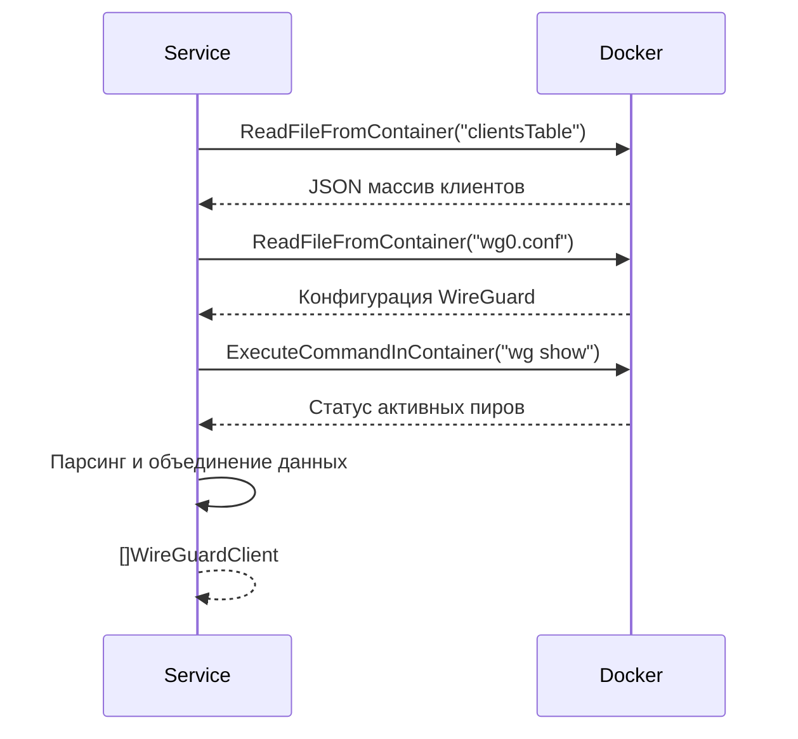
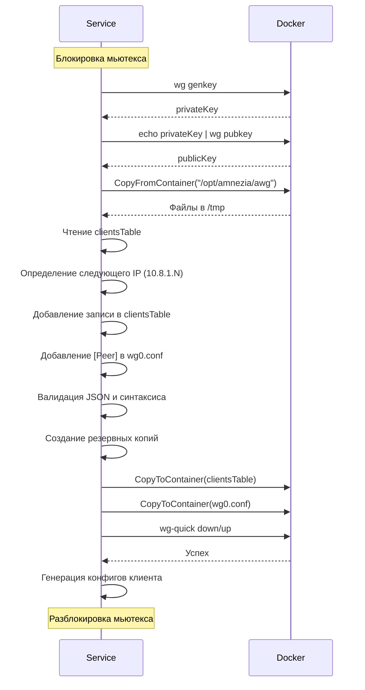
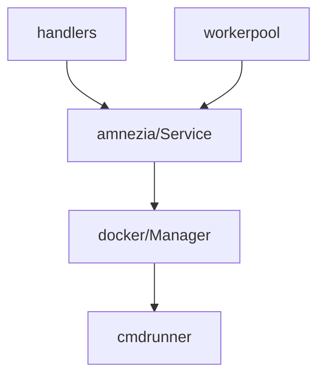

# Модуль: internal/services/amnezia

## Описание

Сервис для управления Amnezia VPN (WireGuard) в Docker-контейнере `amnezia-awg`. Отвечает за создание/удаление клиентов, получение статуса, резервное копирование и откат конфигураций.

## Структура

```go
type Service struct {
    dockerManager DockerManager
    mu            sync.Mutex  // Защита от конкурентных операций
}

type WireGuardClient struct {
    Name            string
    PublicKey       string
    DataReceived    string
    DataSent        string
    LatestHandshake string
    Active          bool
}
```

## Принцип работы

### Получение списка клиентов (`GetWireGuardClients`)



**Источники данных**:
1. `clientsTable` — JSON файл с метаданными клиентов (имя, дата создания)
2. `wg0.conf` — конфигурация WireGuard (все пиры)
3. `wg show` — реальный статус активных соединений

**Объединение**:
- Клиенты из `wg show` получают метаданные из `clientsTable`
- Клиенты только из `wg0.conf` помечаются как неактивные
- Определение активности: последний handshake < 3 минут

### Создание клиента (`CreateWireGuardClient`)



**Шаги создания**:
1. Генерация ключей (`wg genkey` → `wg pubkey`)
2. Копирование папки `/opt/amnezia/awg` из контейнера во временную директорию
3. Создание резервных копий (`clientsTable.backup`, `wg0.conf.backup`)
4. Обновление `clientsTable` (добавление записи с именем и IP)
5. Обновление `wg0.conf` (добавление секции `[Peer]`)
6. Валидация файлов (JSON, синтаксис конфига)
7. Копирование обратно в контейнер
8. Перезапуск WireGuard (`wg-quick down/up`)
9. Генерация конфигов клиента (WireGuard, Amnezia VPN, AmneziaWG)

**Rollback при ошибке**:
- Автоматическое восстановление из `.backup` файлов
- Логирование ошибок

### Удаление клиента (`RemoveWireGuardClient`)

Аналогично созданию, но:
1. Удаление записи из `clientsTable` по `PublicKey`
2. Удаление секции `[Peer]` из `wg0.conf`
3. Валидация и копирование обратно
4. Перезапуск WireGuard

**Парсинг `wg0.conf`**:
- Построчный анализ блоков `[Peer]`
- Удаление блока с нужным `PublicKey`
- Проверка, что ключ действительно удалён

### Статус WireGuard (`GetWireGuardStatus`)

Простое выполнение команды:
```go
output, err := s.dockerManager.ExecuteCommandInContainer("amnezia-awg", "wg", "show")
```

### Резервное копирование и откат

#### Создание бэкапа (`BackupConfigFiles`)

Копирует `clientsTable` и `wg0.conf` в файлы `.backup` в той же директории.

#### Откат (`RollbackConfigFiles`)

Восстанавливает файлы из `.backup`.

### Генерация конфигов клиента

#### WireGuard формат (`createWireGuardConfig`)

Стандартный формат WireGuard:
```ini
[Interface]
PrivateKey = <private>
Address = <ip>
DNS = 1.1.1.1

[Peer]
PublicKey = <server_public>
PresharedKey = <psk>
AllowedIPs = 0.0.0.0/0
Endpoint = <ip>:31662
PersistentKeepalive = 25
```

#### Amnezia VPN формат (`createAmneziaVPNConfig`)

Закодированный формат `vpn://`:
1. Извлечение параметров obfuscation из серверного `wg0.conf`
2. Построение JSON конфигурации (`buildAmneziaConfigJSON`)
3. Сжатие zlib
4. Добавление 4-байтового заголовка (длина несжатых данных)
5. Кодирование base64 URL-safe без padding
6. Префикс `vpn://`

#### AmneziaWG текстовый формат (`createAmneziaWGTextConfig`)

Текстовый формат с параметрами obfuscation:
```ini
[Interface]
Address = <ip>
DNS = 8.8.8.8, 8.8.4.4
PrivateKey = <private>
Jc = <value>
Jmin = <value>
Jmax = <value>
S1 = <value>
S2 = <value>
H1 = <value>
H2 = <value>
H3 = <value>
H4 = <value>

[Peer]
PublicKey = <server_public>
PresharedKey = <psk>
AllowedIPs = 0.0.0.0/0, ::/0
Endpoint = bugz1.online:31662
PersistentKeepalive = 25
```

## Взаимодействие с другими модулями



## Зависимости

- `internal/services/docker` — работа с контейнером
- `pkg/logger` — логирование
- Стандартные библиотеки: `encoding/json`, `encoding/base64`, `compress/zlib`

## Особенности

### Потокобезопасность

Все операции создания/удаления защищены мьютексом (`mu sync.Mutex`) для предотвращения конкурентных изменений конфигурации.

### Валидация

- Проверка валидности JSON в `clientsTable`
- Проверка структуры JSON (парсинг в `[]ClientInfo`)
- Проверка наличия секции `[Interface]` в `wg0.conf`

### Резервное копирование

- Автоматическое создание `.backup` файлов перед изменениями
- Автоматический rollback при ошибке
- Логирование всех операций

### Определение активности клиента

Клиент считается активным, если:
- Последний handshake был менее 3 минут назад
- Или handshake был "seconds ago"

### Параметры по умолчанию

Если серверная конфигурация недоступна, используются дефолтные значения:
- Host: `<ip>`
- Port: `31662`
- DNS: `8.8.8.8`, `8.8.4.4`
- MTU: `1376`
- PersistentKeepalive: `25`

## Примеры использования

### Получение списка клиентов

```go
clients, err := service.GetWireGuardClients()
for _, client := range clients {
    fmt.Println(client.String()) // 🟩 Name 100 KiB/50 KiB
}
```

### Создание клиента

```go
wgConfig, amneziaVPN, amneziaWG, err := service.CreateWireGuardClient("Имя клиента")
// wgConfig — стандартный WireGuard конфиг
// amneziaVPN — закодированный vpn:// URL
// amneziaWG — текстовый формат AmneziaWG
```

### Удаление клиента

```go
err := service.RemoveWireGuardClient("public_key_here")
```

### Статус

```go
status, err := service.GetWireGuardStatus()
```

