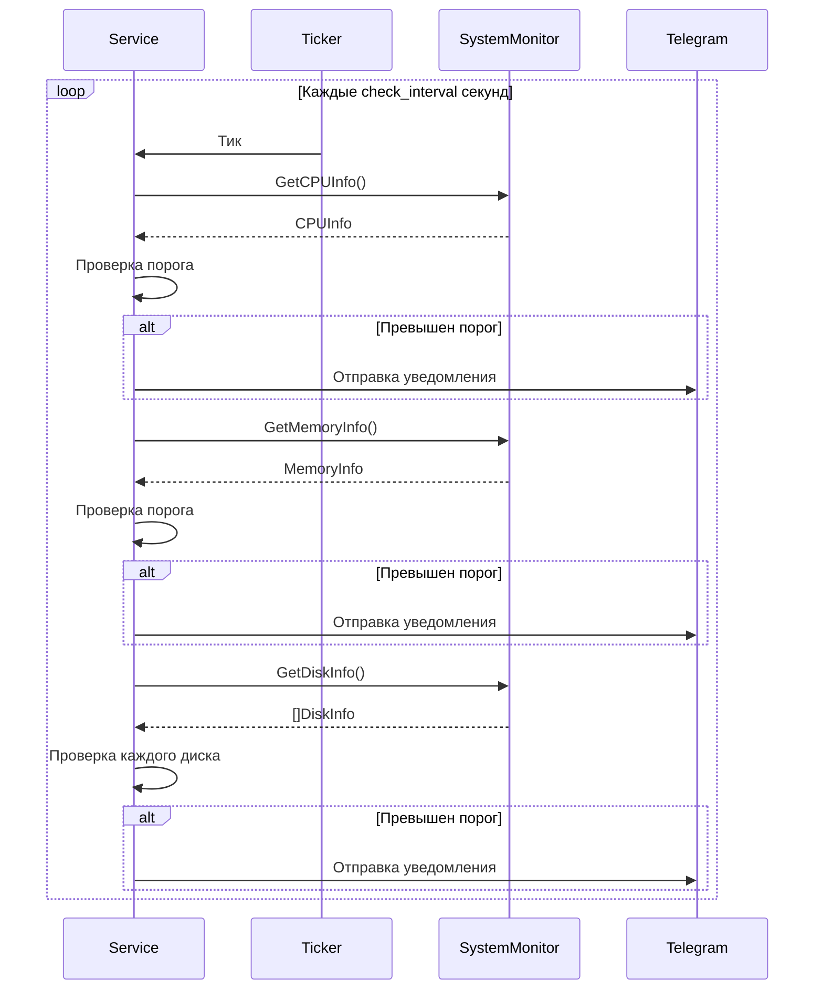
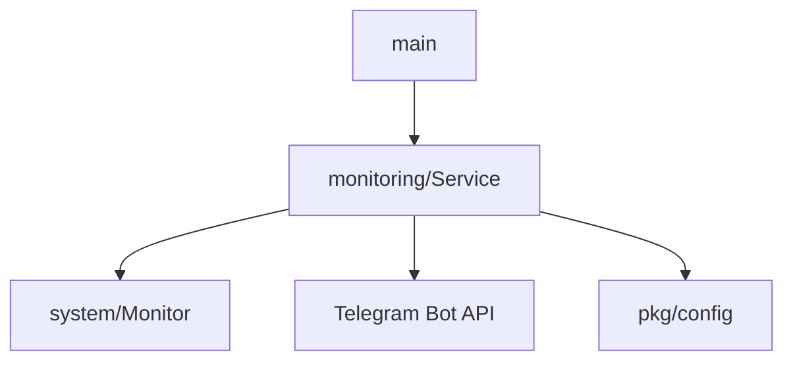

# Модуль: internal/services/monitoring

## Описание

Сервис периодического мониторинга системных метрик (CPU, RAM, Disk) с отправкой уведомлений в Telegram при превышении пороговых значений.

## Структура

```go
type Service struct {
    bot           *tgbotapi.BotAPI
    config        *config.Config
    systemService *system.Monitor
    chatID        int64
    stopChan      chan struct{}
}
```

## Принцип работы

### Инициализация (`NewService`)

Создаёт сервис с:
- Telegram Bot API клиентом
- Конфигурацией (пороги, интервал проверки)
- Системным монитором
- ID чата для уведомлений
- Каналом остановки

### Запуск (`Start`)

Запускает фоновую горутину с циклом мониторинга:



### Проверка метрик (`checkSystemMetrics`)

#### CPU

```go
cpuInfo, err := s.systemService.GetCPUInfo()
if cpuInfo.Load > float64(s.config.Monitoring.CPUThreshold) {
    message := fmt.Sprintf("⚠️ Высокая нагрузка на CPU: %.2f%% (порог: %d%%)", 
        cpuInfo.Load, s.config.Monitoring.CPUThreshold)
    s.sendNotification(message)
}
```

#### Память

```go
memInfo, err := s.systemService.GetMemoryInfo()
if memInfo.UsedPercent > float64(s.config.Monitoring.MemoryThreshold) {
    message := fmt.Sprintf("⚠️ Высокое использование памяти: %.2f%% (порог: %d%%)", 
        memInfo.UsedPercent, s.config.Monitoring.MemoryThreshold)
    s.sendNotification(message)
}
```

#### Диски

```go
diskInfos, err := s.systemService.GetDiskInfo()
for _, diskInfo := range diskInfos {
    freePercent := 100 - diskInfo.UsedPercent
    if freePercent < float64(s.config.Monitoring.DiskThreshold) {
        message := fmt.Sprintf("⚠️ Мало свободного места на диске %s: %.2f%% свободно (порог: %d%%)",
            diskInfo.MountPoint, freePercent, s.config.Monitoring.DiskThreshold)
        s.sendNotification(message)
    }
}
```

**Важно**: Для дисков проверяется **свободное место**, а не использованное.

### Отправка уведомлений (`sendNotification`)

```go
msg := tgbotapi.NewMessage(s.chatID, message)
_, err := s.bot.Send(msg)
if err != nil {
    // Логирование ошибки
    // Попытка отправить в первый разрешённый чат
}
```

### Остановка (`Stop`)

Закрывает канал `stopChan`, что приводит к завершению цикла мониторинга.

## Взаимодействие с другими модулями



## Зависимости

- `internal/services/system` — получение метрик
- `github.com/go-telegram-bot-api/telegram-bot-api` — отправка уведомлений
- `pkg/config` — конфигурация порогов
- `pkg/logger` — логирование

## Конфигурация

```yaml
monitoring:
  check_interval: 30      # Интервал проверки в секундах
  cpu_threshold: 90       # Порог загрузки CPU (%)
  memory_threshold: 90    # Порог использования памяти (%)
  disk_threshold: 10      # Порог свободного места на диске (%)
```

## Особенности

### Независимая работа

Сервис работает в отдельной горутине и не блокирует основной поток бота.

### Пороговые значения

- Пороги можно отключить, установив значение `0`
- CPU и память проверяются на превышение порога
- Диск проверяется на **недостаток** свободного места

### Обработка ошибок

- Ошибки получения метрик логируются, но не прерывают цикл
- Ошибки отправки уведомлений логируются
- При ошибке отправки делается попытка отправить в первый разрешённый чат

### Производительность

- Проверки выполняются последовательно
- Интервал проверки настраивается через конфиг
- Не создаёт дополнительной нагрузки при нормальных значениях метрик

## Примеры использования

### Запуск мониторинга

```go
monitoringService := monitoring.NewService(
    botAPI,
    config,
    systemMonitor,
    chatID,
)
monitoringService.Start()
```

### Остановка

```go
monitoringService.Stop()
```

## Логирование

Все события логируются:
- `monitoring.get_cpu_failed` — ошибка получения CPU
- `monitoring.cpu_threshold_exceeded` — превышение порога CPU
- `monitoring.memory_threshold_exceeded` — превышение порога памяти
- `monitoring.disk_threshold_exceeded` — превышение порога диска
- `monitoring.send_notification_failed` — ошибка отправки уведомления

