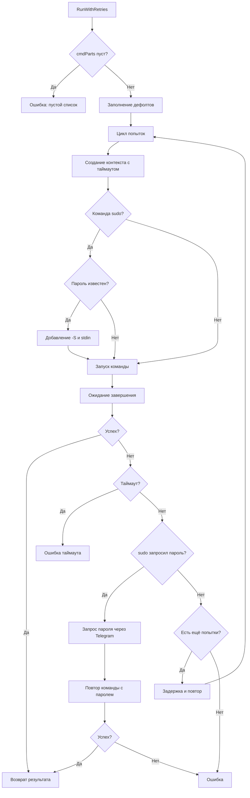
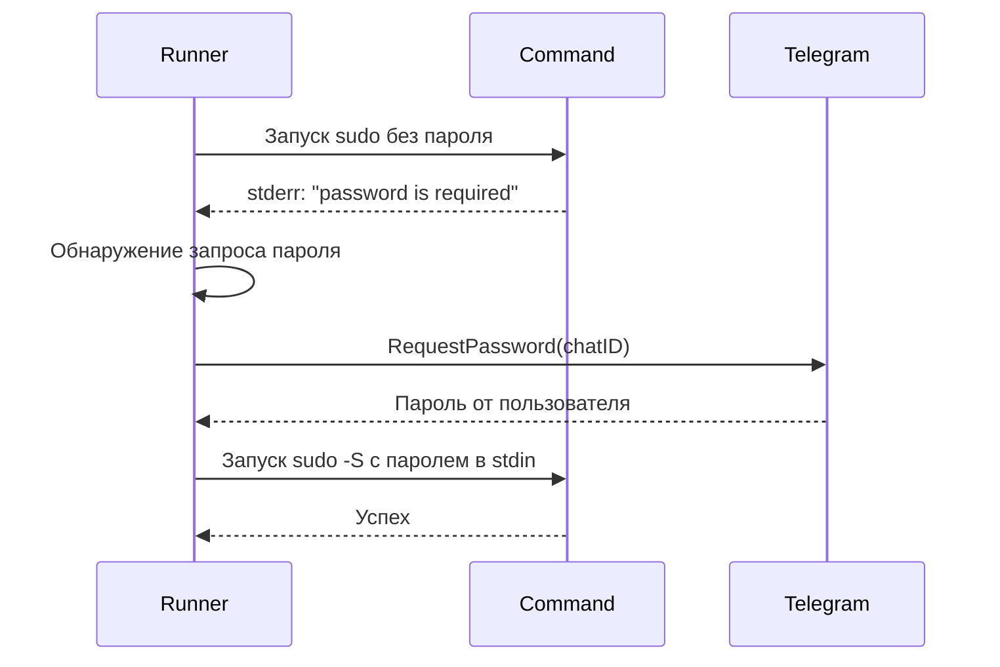
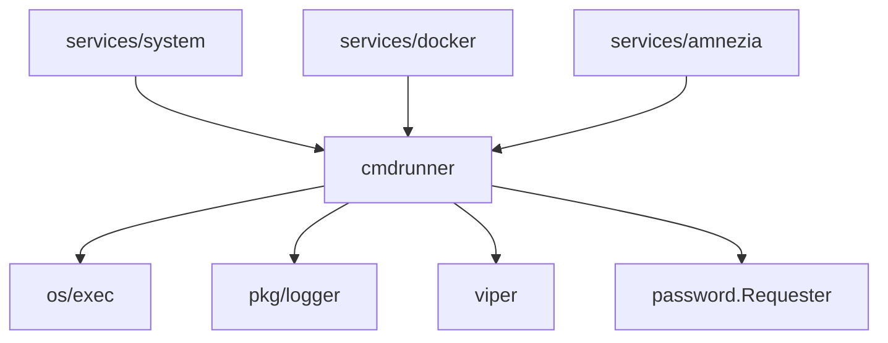

# Модуль: internal/cmdrunner

## Описание

Универсальный модуль для безопасного выполнения внешних команд с поддержкой таймаутов, повторных попыток (retry) и интерактивного запроса sudo-пароля через Telegram.

## Структура

```go
type RunOptions struct {
    Timeout           time.Duration
    Attempts          int
    Password          string
    PasswordFromEnv   bool
    PasswordFromConfig bool
    Requester         PasswordRequester
    ChatID            int64
}

type PasswordRequester interface {
    RequestPassword(chatID int64) (string, error)
}
```

## Принцип работы

### Основная функция (`RunWithRetries`)



### Заполнение дефолтов

Если опции не заданы, берутся из конфига:
- `Timeout` → `cmdrunner.timeout_seconds` (по умолчанию 10 сек)
- `Attempts` → `cmdrunner.attempts` (по умолчанию 1)

### Обработка sudo-пароля

#### Приоритет источников пароля

1. `opts.Password` — явно переданный пароль
2. `SUDO_PASSWORD` — переменная окружения (если `PasswordFromEnv = true`)
3. `cmdrunner.sudo_password` — из конфига (если `PasswordFromConfig = true`)
4. Запрос через Telegram (если `Requester != nil` и `ChatID != 0`)

#### Логика "пароль по требованию"



**Определение запроса пароля**:
- Проверка stderr на наличие фраз:
  - `"password is required"`
  - `"a password is required"`
  - `"sudo:"` + `"password"`
  - `"no tty present and no askpass program specified"`
  - `"try again."`

**Если пароль найден заранее**:
- Команда сразу модифицируется: добавляется `-S` после `sudo`
- Пароль передаётся в stdin

### Retry механизм

```go
for i := 0; i < opts.Attempts; i++ {
    // Выполнение команды
    if err == nil {
        return result, nil
    }
    // Задержка перед следующей попыткой
    time.Sleep(time.Duration(200*attemptNum) * time.Millisecond)
}
```

Задержка увеличивается с каждой попыткой: 200ms, 400ms, 600ms...

### Захват вывода

```go
var stdoutBuf, stderrBuf bytes.Buffer
cmd.Stdout = &stdoutBuf
cmd.Stderr = &stderrBuf
```

Результат объединяется: `stdout + "\n" + stderr` (если stderr не пуст).

### Логирование

Логируется каждая попытка:
- Команда (маскируются чувствительные данные)
- Номер попытки
- Код возврата
- stdout/stderr (обрезаются до 2000 символов)

## Взаимодействие с другими модулями



## Зависимости

- `os/exec` — выполнение команд
- `pkg/logger` — логирование
- `github.com/spf13/viper` — конфигурация
- `internal/password` — запрос паролей через Telegram

## Особенности

### Безопасность

- Пароли маскируются в логах через `logger.MaskSensitiveFields`
- Пароль передаётся только через stdin, не через аргументы командной строки
- Чувствительные данные (ключи, токены) автоматически маскируются

### Таймауты

- Каждая попытка имеет свой таймаут
- Таймаут задаётся через контекст (`context.WithTimeout`)
- При превышении таймаута команда убивается

### Обработка ошибок

- Разделение stdout и stderr для корректной диагностики
- Детальное логирование всех попыток
- Возврат последней ошибки при исчерпании попыток

## Примеры использования

### Простая команда

```go
parts := []string{"ls", "-la"}
opts := cmdrunner.RunOptions{
    Timeout: 10 * time.Second,
    Attempts: 1,
}
output, err := cmdrunner.RunWithRetries(ctx, parts, opts)
```

### Команда с sudo (пароль из конфига)

```go
parts := []string{"sudo", "systemctl", "restart", "nginx"}
opts := cmdrunner.RunOptions{
    Timeout: 30 * time.Second,
    Attempts: 3,
    PasswordFromConfig: true,
}
output, err := cmdrunner.RunWithRetries(ctx, parts, opts)
```

### Команда с запросом пароля через Telegram

```go
parts := []string{"sudo", "reboot"}
opts := cmdrunner.RunOptions{
    Timeout: 10 * time.Second,
    Attempts: 1,
    Requester: passwordRequester,
    ChatID: chatID,
}
output, err := cmdrunner.RunWithRetries(ctx, parts, opts)
```

## Конфигурация

```yaml
cmdrunner:
  timeout_seconds: 30
  attempts: 3
  sudo_password: ""  # Опционально
```

## Логирование

События:
- `cmdrunner.start_failed` — ошибка запуска команды
- `cmdrunner.attempt` — результат попытки (debug уровень)
- `cmdrunner.task_timeout` — таймаут задачи (workerpool)

