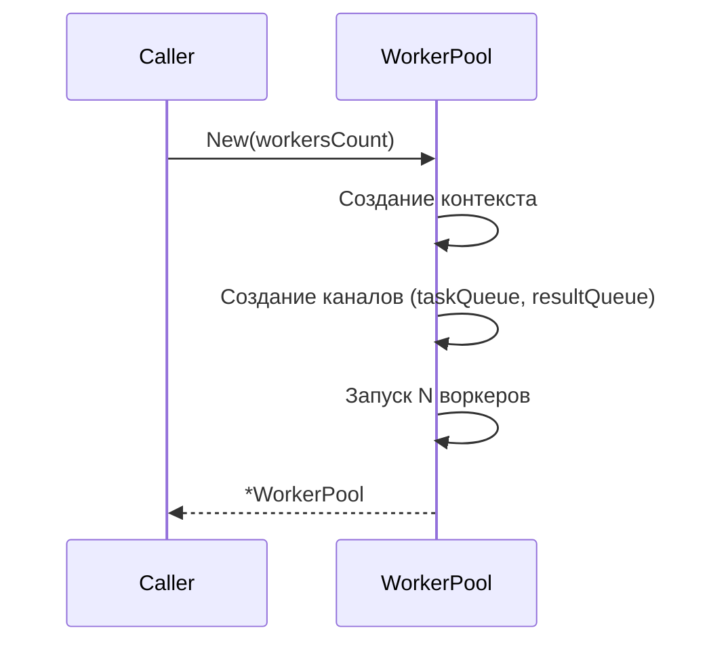
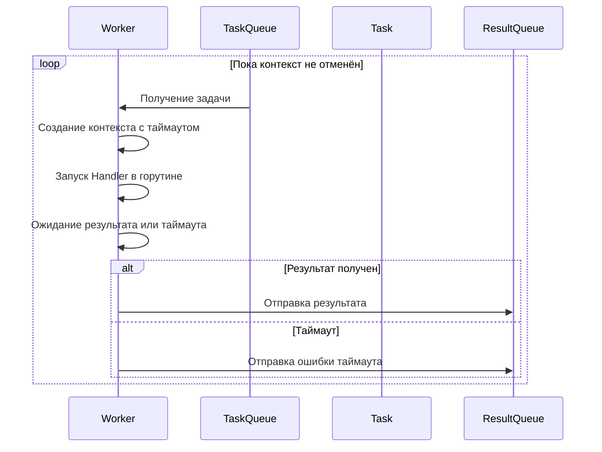
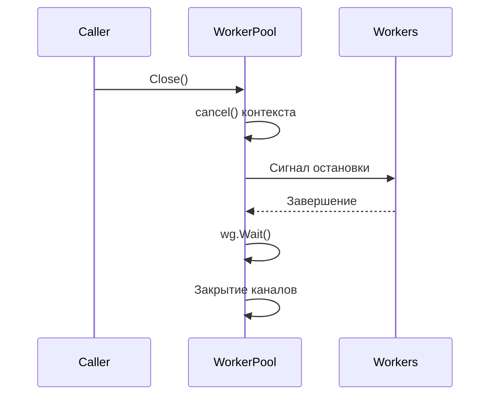
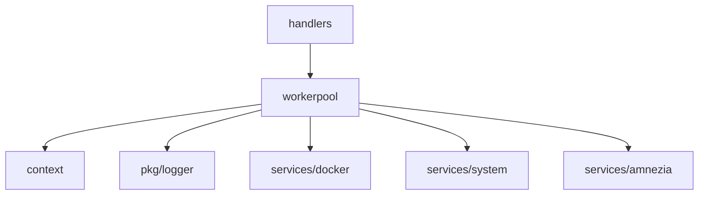

# Модуль: internal/workerpool

## Описание

Пул воркеров для асинхронного выполнения задач с поддержкой таймаутов. Используется для длительных операций (Docker, systemd, WireGuard), чтобы не блокировать основной поток обработки Telegram-обновлений.

## Структура

```go
type Task struct {
    ID      string
    Handler func() (interface{}, error)
    Timeout time.Duration
}

type Result struct {
    ID    string
    Value interface{}
    Error error
}

type WorkerPool struct {
    workersCount int
    taskQueue    chan Task
    resultQueue  chan Result
    wg           sync.WaitGroup
    ctx          context.Context
    cancel       context.CancelFunc
}
```

## Принцип работы

### Инициализация (`New`)



**Создание каналов**:
- `taskQueue` — буферизованный канал на 100 задач
- `resultQueue` — буферизованный канал на 100 результатов

**Запуск воркеров**:
- Запускается `workersCount` горутин
- Каждая горутина выполняет функцию `worker()`

### Воркер (`worker`)



**Логика выполнения задачи**:

```go
// Создаём контекст с таймаутом задачи
ctx, cancel := context.WithTimeout(wp.ctx, task.Timeout)

// Канал для результата
resultChan := make(chan Result, 1)

// Выполняем задачу в горутине
go func() {
    value, err := task.Handler()
    resultChan <- Result{ID: task.ID, Value: value, Error: err}
}()

// Ждём результат или таймаут
select {
case result := <-resultChan:
    wp.resultQueue <- result
case <-ctx.Done():
    wp.resultQueue <- Result{ID: task.ID, Error: ctx.Err()}
}
```

### Отправка задачи (`Submit`)

```go
select {
case wp.taskQueue <- task:
    // Задача отправлена
case <-wp.ctx.Done():
    // Пул закрыт, отправляем ошибку
    wp.resultQueue <- Result{ID: task.ID, Error: wp.ctx.Err()}
}
```

### Получение результатов (`Results`)

Возвращает канал результатов для чтения:

```go
func (wp *WorkerPool) Results() <-chan Result {
    return wp.resultQueue
}
```

### Закрытие (`Close`)



**Процесс закрытия**:
1. Отмена контекста (`wp.cancel()`)
2. Ожидание завершения всех воркеров (`wp.wg.Wait()`)
3. Закрытие каналов (`close(wp.taskQueue)`, `close(wp.resultQueue)`)

## Взаимодействие с другими модулями



## Зависимости

- `context` — управление жизненным циклом
- `sync` — синхронизация горутин
- `pkg/logger` — логирование

## Особенности

### Асинхронность

Все задачи выполняются в отдельных горутинах, не блокируя основной поток.

### Таймауты

Каждая задача имеет свой таймаут, заданный при создании. При превышении таймаута задача прерывается, но воркер продолжает работу.

### Буферизация

Каналы буферизованы на 100 элементов, что позволяет отправлять задачи без блокировки, если есть свободные слоты.

### Graceful shutdown

При закрытии пула:
- Новые задачи не принимаются
- Выполняющиеся задачи завершаются естественным образом
- Воркеры корректно завершаются

## Примеры использования

### Создание пула

```go
workerPool := workerpool.New(5) // 5 воркеров
defer workerPool.Close()
```

### Отправка задачи

```go
task := workerpool.Task{
    ID: "restart_container_123",
    Handler: func() (interface{}, error) {
        return dockerService.RestartContainer("123")
    },
    Timeout: 60 * time.Second,
}
workerPool.Submit(task)
```

### Получение результата

```go
result := <-workerPool.Results()
if result.Error != nil {
    log.Printf("Ошибка задачи %s: %v", result.ID, result.Error)
} else {
    log.Printf("Задача %s выполнена: %v", result.ID, result.Value)
}
```

### Полный пример

```go
// Создание пула
pool := workerpool.New(3)
defer pool.Close()

// Отправка нескольких задач
for i := 0; i < 10; i++ {
    task := workerpool.Task{
        ID: fmt.Sprintf("task_%d", i),
        Handler: func() (interface{}, error) {
            time.Sleep(1 * time.Second)
            return fmt.Sprintf("Result %d", i), nil
        },
        Timeout: 5 * time.Second,
    }
    pool.Submit(task)
}

// Получение результатов
for i := 0; i < 10; i++ {
    result := <-pool.Results()
    fmt.Printf("Task %s: %v\n", result.ID, result.Value)
}
```

## Конфигурация

```yaml
workerpool:
  workers_count: 5  # Количество воркеров
```

## Логирование

События:
- `workerpool.task_submitted` — задача отправлена в пул (debug)
- `workerpool.task_completed` — задача выполнена успешно (debug)
- `workerpool.task_timeout` — таймаут задачи (warn)
- `workerpool.submit_cancelled` — попытка отправить задачу в закрытый пул (error)

## Производительность

- Количество воркеров должно соответствовать нагрузке
- Слишком много воркеров может привести к перегрузке системы
- Слишком мало воркеров — к очереди задач
- Рекомендуется: количество CPU cores или немного больше

