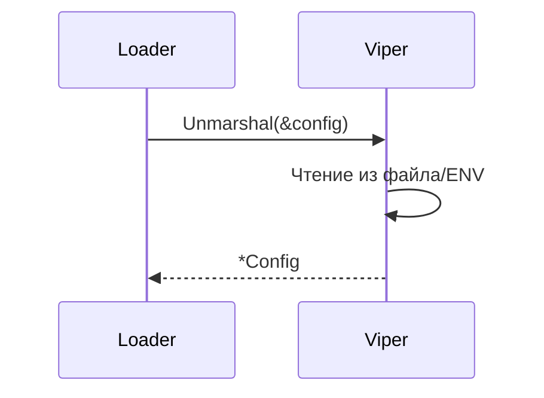
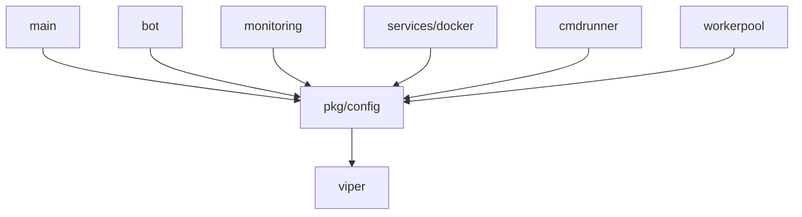

# Модуль: pkg/config

## Описание

Модуль для типизированной загрузки и работы с конфигурацией приложения. Использует `viper` для чтения YAML-файлов и переменных окружения.

## Структура

```go
type Config struct {
    Bot        BotConfig
    Monitoring MonitoringConfig
    Docker     DockerConfig
    CmdRunner  CmdRunnerConfig
    WorkerPool WorkerPoolConfig
}

type BotConfig struct {
    Token         string
    AllowedChats  []int64
    UpdateTimeout int
}

type MonitoringConfig struct {
    CheckInterval   int
    CPUThreshold    int
    MemoryThreshold int
    DiskThreshold   int
}

type DockerConfig struct {
    Socket       string
    Timeout      int
    Bin          string
    CommandPrefix []string
    TmpDir       string
    WgPath       string
}

type CmdRunnerConfig struct {
    TimeoutSeconds int
    Attempts       int
    SudoPassword   string
}

type WorkerPoolConfig struct {
    WorkersCount int
}
```

## Принцип работы

### Загрузка конфигурации (`Load`)



**Процесс**:
1. `viper` уже настроен в `main.go` (читает файл или использует дефолты)
2. `Unmarshal` преобразует данные из viper в структуру `Config`
3. Возвращается типизированная конфигурация

### Инициализация в main.go

```go
// Проверка CONFIG_PATH
configPath := os.Getenv("CONFIG_PATH")
if configPath != "" {
    viper.SetConfigFile(configPath)
} else {
    viper.SetConfigName("config")
    viper.SetConfigType("yaml")
    viper.AddConfigPath(".")
}

// Чтение конфигурации
viper.ReadInConfig()

// Загрузка в структуру
cfg, err := config.Load()
```

## Структура конфигурационного файла

```yaml
bot:
  token: "YOUR_TELEGRAM_BOT_TOKEN"
  allowed_chats:
    - 123456789
    - 987654321
  update_timeout: 60

monitoring:
  check_interval: 30
  cpu_threshold: 90
  memory_threshold: 90
  disk_threshold: 10

docker:
  socket: "/var/run/docker.sock"
  timeout: 30
  bin: "docker"
  command_prefix:
    - "sudo"
  tmp_dir: "/tmp"
  wg_path: "/opt/amnezia/awg"

cmdrunner:
  timeout_seconds: 30
  attempts: 3
  sudo_password: ""

workerpool:
  workers_count: 5
```

## Взаимодействие с другими модулями



## Зависимости

- `github.com/spf13/viper` — загрузка конфигурации

## Особенности

### Типизация

Все значения конфигурации типизированы, что предотвращает ошибки типов на этапе компиляции.

### Значения по умолчанию

Если конфигурационный файл отсутствует, `main.go` создаёт его с дефолтными значениями через `createDefaultConfig()`.

### Переменные окружения

Viper поддерживает переменные окружения, но в текущей реализации используется только `CONFIG_PATH` для указания пути к файлу.

### Валидация

Валидация значений не выполняется на уровне `pkg/config`. Каждый модуль сам проверяет корректность значений при использовании.

## Примеры использования

### Загрузка конфигурации

```go
cfg, err := config.Load()
if err != nil {
    log.Fatal(err)
}
```

### Использование значений

```go
// В bot
api, err := tgbotapi.NewBotAPI(cfg.Bot.Token)

// В monitoring
ticker := time.NewTicker(time.Duration(cfg.Monitoring.CheckInterval) * time.Second)

// В docker
manager, err := docker.NewManager(
    cfg.Docker.Socket,
    cfg.Docker.Timeout,
    cfg.Docker.Bin,
    cfg.Docker.CommandPrefix,
)
```

## Расширение конфигурации

Для добавления новых параметров:

1. Добавить поле в соответствующую структуру конфига
2. Добавить тег `mapstructure:"field_name"` для соответствия YAML
3. Обновить дефолтные значения в `main.go:createDefaultConfig()`
4. Использовать новое поле в модулях

## Безопасность

- Токены и пароли хранятся в открытом виде в YAML-файле
- Рекомендуется использовать права доступа `600` для конфигурационного файла
- В будущем можно добавить поддержку секретов через переменные окружения или secret manager

