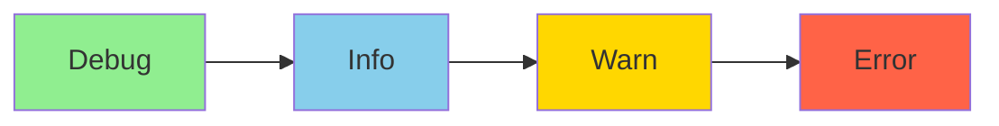
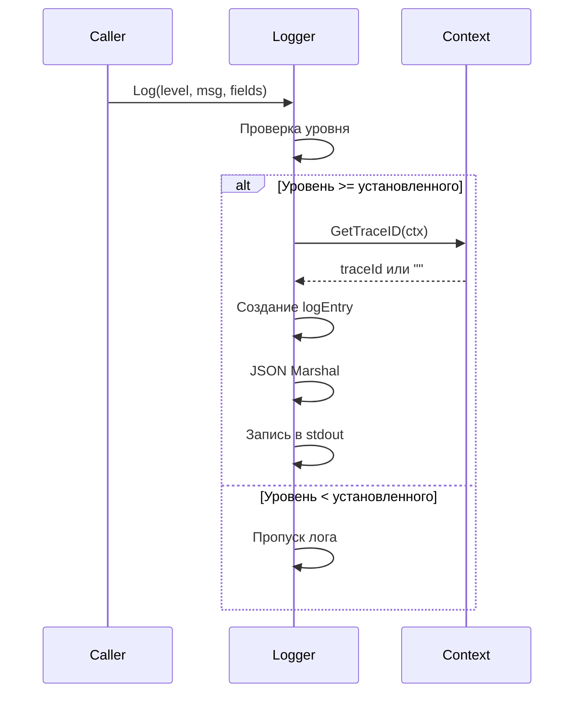
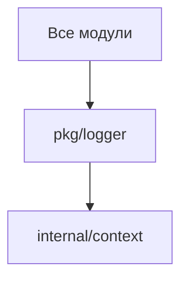

# Модуль: pkg/logger

## Описание

Модуль структурированного логирования в формате JSON с поддержкой уровней логирования, трассировки запросов через `traceId` и автоматического маскирования чувствительных данных.

## Структура

```go
type Level int32

const (
    Debug Level = iota
    Info
    Warn
    Error
)

type logEntry struct {
    Time    string
    Level   string
    Msg     string
    TraceID string                 `json:"traceId,omitempty"`
    Fields  map[string]interface{} `json:"fields,omitempty"`
}
```

## Принцип работы

### Уровни логирования



**Правило**: Логи с уровнем ниже установленного не записываются.

### Установка уровня (`SetLevel`)

```go
logger.SetLevel("debug")  // Регистронезависимо
logger.SetLevel("info")
logger.SetLevel("warn")
logger.SetLevel("error")
```

Уровень хранится в атомарной переменной `levelInt` для потокобезопасности.

### Запись лога (`Log`, `LogWithCtx`)



**Формат JSON**:
```json
{
  "time": "2024-01-15T10:30:45.123456789Z",
  "level": "info",
  "msg": "bot.authorized",
  "traceId": "1234567890123456789",
  "fields": {
    "username": "my_bot"
  }
}
```

### Маскирование чувствительных данных

#### Маскирование ключей (`MaskKey`)

```go
MaskKey("short")           // "****"
MaskKey("abcdefghijklmn")  // "abcd****klmn" (первые 4 + последние 4)
MaskKey("already****masked") // "already****masked" (не маскирует повторно)
```

**Правила**:
- Строки ≤ 8 символов → `"****"`
- Строки > 8 символов → первые 4 + звездочки + последние 4
- Уже замаскированные строки не обрабатываются

#### Маскирование полей (`MaskSensitiveFields`)

Автоматически маскирует значения полей, если ключ содержит:
- `"key"` (например, `public_key`, `private_key`)
- `"token"` (например, `bot_token`, `api_token`)
- `"public"` (например, `public_key`)

**Пример**:
```go
fields := map[string]interface{}{
    "public_key": "abc123def456",
    "username": "user",
}
masked := logger.MaskSensitiveFields(fields)
// Результат: {"public_key": "abc1****f456", "username": "user"}
```

## Взаимодействие с другими модулями



## Зависимости

- `internal/context` — получение `traceId` из контекста
- Стандартные библиотеки: `encoding/json`, `os`, `sync/atomic`

## Особенности

### Потокобезопасность

- Уровень логирования хранится в атомарной переменной
- Запись в stdout безопасна для конкурентного доступа

### Трассировка

- `traceId` извлекается из контекста через `contextpkg.GetTraceID(ctx)`
- Если `traceId` отсутствует, поле не включается в JSON (`omitempty`)

### Формат вывода

- Все логи в формате JSON, одна строка = одна запись
- Удобно для парсинга и анализа (ELK, Loki, etc.)
- При ошибке сериализации используется резервный формат

### Производительность

- Проверка уровня выполняется до создания структуры лога
- Логи ниже уровня не создаются, что экономит ресурсы

## Примеры использования

### Простой лог

```go
logger.Log(logger.Info, "operation.completed", map[string]interface{}{
    "duration_ms": 150,
})
```

### Лог с контекстом

```go
ctx := contextpkg.WithTraceID(ctx, "trace123")
logger.LogWithCtx(ctx, logger.Debug, "processing.request", map[string]interface{}{
    "user_id": 123,
})
```

### Лог с маскированием

```go
fields := map[string]interface{}{
    "public_key": "abc123def456",
    "token": "secret_token",
    "username": "user",
}
logger.Log(logger.Info, "user.action", logger.MaskSensitiveFields(fields))
// public_key и token будут замаскированы
```

### Обработка ошибок

```go
if err != nil {
    logger.Log(logger.Error, "operation.failed", map[string]interface{}{
        "error": err.Error(),
        "operation": "create_client",
    })
}
```

## Конвенции именования сообщений

Рекомендуемый формат: `<module>.<action>` или `<module>.<action>_<result>`

Примеры:
- `bot.authorized`
- `cmdrunner.start_failed`
- `amnezia.create_client_failed`
- `monitoring.cpu_threshold_exceeded`

## Интеграция с системами логирования

### ELK Stack

```bash
# Настройка Filebeat для чтения stdout
filebeat.inputs:
  - type: container
    paths:
      - '/var/log/containers/*.log'
    json.keys_under_root: true
    json.add_error_key: true
```

### Loki

```yaml
# Promtail конфигурация
scrape_configs:
  - job_name: tgbot
    static_configs:
      - targets:
          - localhost
        labels:
          job: tgbot
          __path__: /var/log/tgbot/*.log
```

### Grafana

Можно использовать JSON-логи напрямую в Grafana Loki с парсингом полей.

## Расширение

Для добавления новых уровней или форматов можно расширить `Level` и `logEntry`, но текущая реализация покрывает все стандартные потребности.

