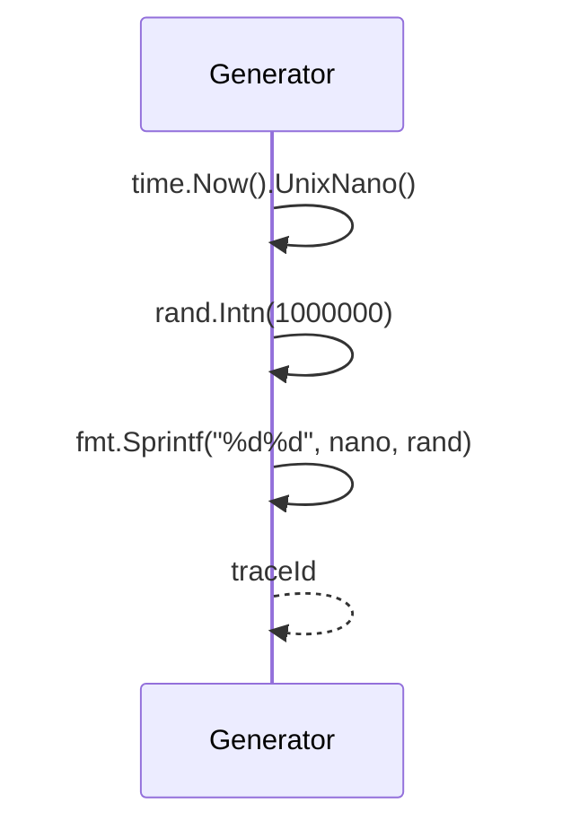
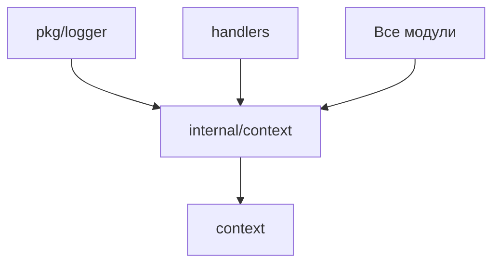

# Модуль: internal/context

## Описание

Модуль для управления контекстом запросов с поддержкой трассировки через `traceId`. Позволяет связывать все логи и операции, относящиеся к одному запросу пользователя.

## Структура

```go
type ContextKey string

const (
    TraceIDKey ContextKey = "traceId"
)

func GenerateTraceID() string
func WithTraceID(ctx context.Context, traceID string) context.Context
func GetTraceID(ctx context.Context) string
```

## Принцип работы

### Генерация traceId (`GenerateTraceID`)



**Формат**: `<unix_nano><random_6_digits>`

Пример: `1705312245123456789123456`

**Уникальность**:
- Комбинация времени в наносекундах и случайного числа обеспечивает высокую вероятность уникальности
- Даже при множественных запросах в одно и то же время случайная часть различается

### Добавление traceId в контекст (`WithTraceID`)

```go
ctx := context.Background()
ctx = contextpkg.WithTraceID(ctx, "trace123")
```

Использует стандартный `context.WithValue` с типобезопасным ключом `TraceIDKey`.

### Извлечение traceId (`GetTraceID`)

```go
traceID := contextpkg.GetTraceID(ctx)
if traceID == "" {
    // traceId отсутствует
}
```

**Безопасное извлечение**:
- Проверка наличия значения в контексте
- Type assertion для преобразования `interface{}` в `string`
- Возврат пустой строки, если `traceId` отсутствует или имеет неверный тип

## Взаимодействие с другими модулями



## Зависимости

- `context` — стандартная библиотека Go
- `math/rand` — генерация случайных чисел
- `time` — получение времени

## Особенности

### Типобезопасность

Использование кастомного типа `ContextKey` предотвращает коллизии ключей в контексте:

```go
// Плохо (может конфликтовать с другими ключами)
ctx = context.WithValue(ctx, "traceId", id)

// Хорошо (типобезопасный ключ)
ctx = context.WithValue(ctx, TraceIDKey, id)
```

### Потокобезопасность

- `context.Context` потокобезопасен для чтения
- Запись в контекст должна происходить до передачи в горутины

### Производительность

- Генерация `traceId` очень быстрая (наносекунды)
- Извлечение из контекста — O(1) операция

## Примеры использования

### Генерация и добавление traceId

```go
// В начале обработки запроса
traceID := contextpkg.GenerateTraceID()
ctx := contextpkg.WithTraceID(context.Background(), traceID)

// Передача контекста в функции
processRequest(ctx, data)
```

### Использование в логах

```go
ctx := contextpkg.WithTraceID(ctx, traceID)
logger.LogWithCtx(ctx, logger.Info, "operation.started", fields)
// traceId автоматически добавится в лог
```

### Извлечение для передачи в другие системы

```go
traceID := contextpkg.GetTraceID(ctx)
if traceID != "" {
    // Добавить traceId в HTTP заголовок
    req.Header.Set("X-Trace-ID", traceID)
}
```

## Интеграция с handlers

В обработчиках команд можно генерировать `traceId` для каждого запроса:

```go
func (h *CommandHandler) HandleCommand(update tgbotapi.Update) {
    traceID := contextpkg.GenerateTraceID()
    ctx := contextpkg.WithTraceID(context.Background(), traceID)
    
    // Все логи в этой функции будут иметь traceId
    logger.LogWithCtx(ctx, logger.Info, "command.received", fields)
    
    // Передача контекста в сервисы
    result, err := h.dockerService.DoSomething(ctx)
}
```

## Расширение

Для добавления других значений в контекст можно создать новые константы:

```go
const (
    TraceIDKey ContextKey = "traceId"
    UserIDKey  ContextKey = "userId"  // Пример расширения
)

func WithUserID(ctx context.Context, userID int64) context.Context {
    return context.WithValue(ctx, UserIDKey, userID)
}
```

## Best Practices

1. **Генерировать traceId на границе системы** (в handlers)
2. **Передавать контекст через все слои** (handlers → services → cmdrunner)
3. **Использовать LogWithCtx** вместо Log для автоматического добавления traceId
4. **Не создавать новый traceId** внутри обработки запроса

