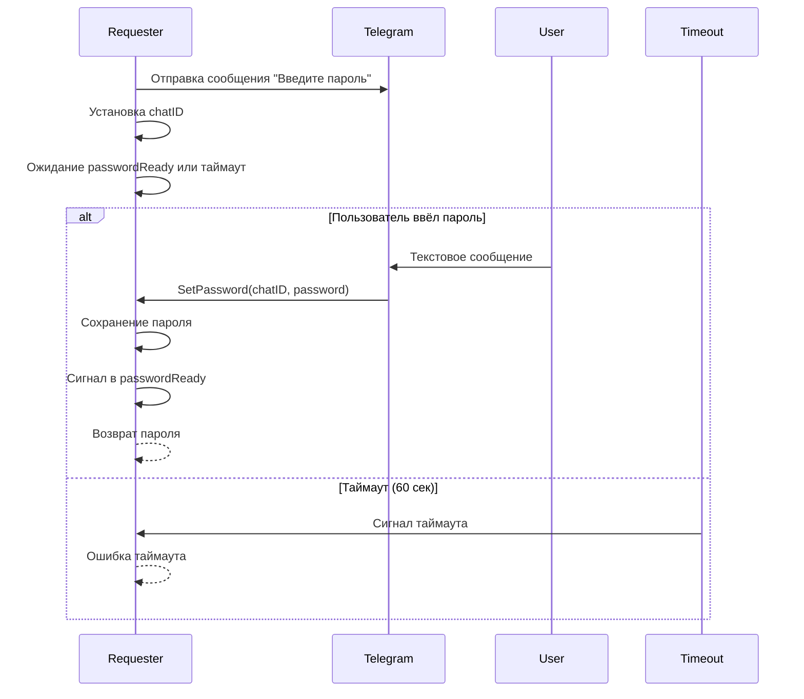
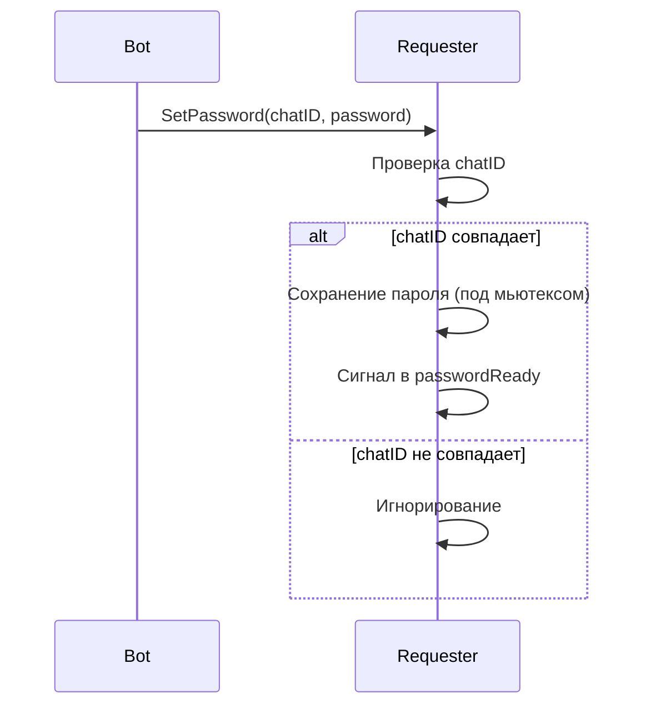
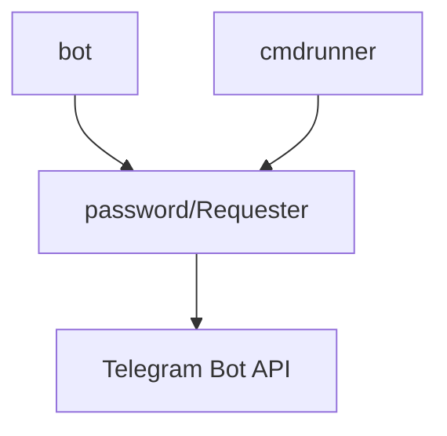

# Модуль: internal/password

## Описание

Модуль для интерактивного запроса sudo-пароля через Telegram. Используется в `cmdrunner` для выполнения команд, требующих пароль, когда он не задан заранее.

## Структура

```go
type Requester struct {
    bot           *tgbotapi.BotAPI
    chatID        int64
    password      string
    passwordMu    sync.Mutex
    passwordReady chan struct{}
}

func NewRequester(bot *tgbotapi.BotAPI) *Requester
func (r *Requester) RequestPassword(chatID int64) (string, error)
func (r *Requester) SetPassword(chatID int64, password string)
```

## Принцип работы

### Инициализация (`NewRequester`)

Создаёт структуру с:
- Telegram Bot API клиентом
- Буферизованным каналом `passwordReady` для сигнализации готовности пароля

### Запрос пароля (`RequestPassword`)



**Процесс**:
1. Отправка сообщения пользователю с запросом пароля
2. Сохранение `chatID` для проверки соответствия
3. Ожидание сигнала в канале `passwordReady` или таймаут 60 секунд
4. Возврат пароля или ошибки таймаута

### Установка пароля (`SetPassword`)



**Безопасность**:
- Проверка `chatID` предотвращает использование пароля от другого пользователя
- Мьютекс защищает от конкурентного доступа к `password`
- Канал буферизован (размер 1), чтобы не блокировать при повторных вызовах

## Взаимодействие с другими модулями



## Зависимости

- `github.com/go-telegram-bot-api/telegram-bot-api` — отправка сообщений
- `sync` — мьютекс для потокобезопасности

## Особенности

### Потокобезопасность

- Мьютекс защищает запись/чтение `password`
- Канал `passwordReady` буферизован для предотвращения блокировок

### Таймаут

- Таймаут 60 секунд предотвращает бесконечное ожидание
- После таймаута возвращается ошибка, команда не выполняется

### Проверка chatID

- Пароль принимается только от того пользователя, который запросил его
- Предотвращает использование пароля от другого чата

### Одноразовость

- После получения пароля он используется один раз
- Для следующей команды потребуется новый запрос

## Примеры использования

### Создание Requester

```go
passwordRequester := password.NewRequester(botAPI)
```

### Запрос пароля в cmdrunner

```go
opts := cmdrunner.RunOptions{
    Requester: passwordRequester,
    ChatID: chatID,
}
output, err := cmdrunner.RunWithRetries(ctx, parts, opts)
```

### Обработка в bot

В `bot.go` при получении текстового сообщения:

```go
if update.Message != nil && update.Message.Text != "" {
    if b.isAuthorized(update.Message.Chat.ID) {
        b.passwordRequester.SetPassword(update.Message.Chat.ID, update.Message.Text)
    }
}
```

## Безопасность

### Ограничения

- Пароль передаётся в открытом виде через Telegram
- Пароль хранится в памяти только на время выполнения команды
- После использования пароль не сохраняется

### Рекомендации

1. Использовать только в доверенных чатах
2. Рассмотреть использование переменной окружения или конфига для пароля
3. В будущем можно добавить шифрование пароля перед отправкой

## Расширение

Для поддержки нескольких одновременных запросов можно использовать map:

```go
type Requester struct {
    bot            *tgbotapi.BotAPI
    pendingPasswords map[int64]chan string
    mu              sync.RWMutex
}
```

Но текущая реализация достаточна для большинства случаев использования.

