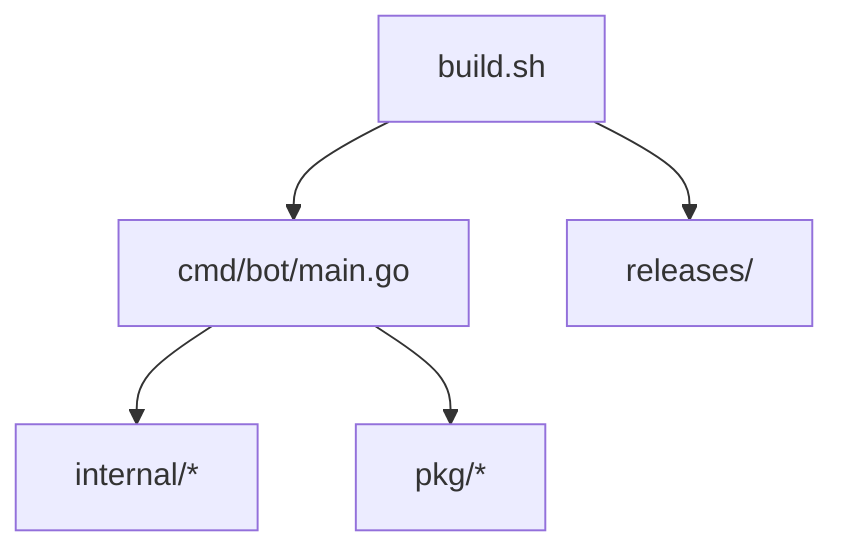

# Модуль: build.sh

## Описание

Скрипт сборки Telegram Server Bot для различных архитектур. Создаёт исполняемые файлы для целевых платформ и размещает их в директории `releases/`.

## Структура

```bash
#!/bin/bash

# Скрипт сборки Telegram Server Bot для разных архитектур

set -e

echo "Сборка Telegram Server Bot..."

# Создание директории для релизов
mkdir -p releases

# Сборка для Linux AMD64
echo "Сборка для Linux AMD64..."
GOOS=linux GOARCH=amd64 go build -o releases/server-bot-linux-amd64 cmd/bot/main.go

echo "Сборка завершена! Файлы находятся в директории releases."
```

## Принцип работы

### Подготовка

1. Установка флага `set -e` для немедленного завершения при ошибках
2. Вывод приветственного сообщения
3. Создание директории `releases/` для хранения собранных бинарных файлов

### Сборка

1. Установка переменных окружения для кросс-компиляции:
   - `GOOS=linux` — целевая операционная система
   - `GOARCH=amd64` — целевая архитектура процессора
2. Выполнение команды сборки Go:
   - `go build -o releases/server-bot-linux-amd64 cmd/bot/main.go` — компиляция исходного кода в исполняемый файл

### Результат

Созданный бинарный файл `server-bot-linux-amd64` размещается в директории `releases/`, откуда он может быть использован для деплоя на сервер.

## Взаимодействие с другими модулями



## Зависимости

- Go 1.16+ — для компиляции исходного кода
- Доступ к исходным файлам проекта
- Права на запись в директорию проекта (для создания `releases/`)

## Особенности

- Поддерживает кросс-компиляцию для различных платформ (в текущей версии только Linux AMD64)
- Автоматически создает директорию для релизов
- Использует флаг `set -e` для обеспечения надежности сборки
- Может быть легко расширен для поддержки других архитектур

## Расширение функциональности

Для добавления поддержки других архитектур можно добавить дополнительные блоки сборки:

```bash
# Сборка для Linux ARM64
echo "Сборка для Linux ARM64..."
GOOS=linux GOARCH=arm64 go build -o releases/server-bot-linux-arm64 cmd/bot/main.go

# Сборка для Windows AMD64
echo "Сборка для Windows AMD64..."
GOOS=windows GOARCH=amd64 go build -o releases/server-bot-windows-amd64.exe cmd/bot/main.go