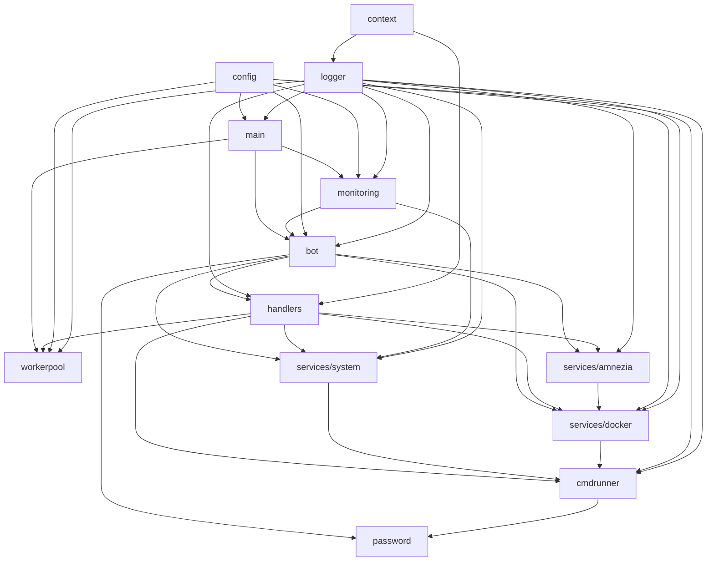

# Документация модулей Telegram Server Bot

Документация по каждому модулю проекта. Каждый модуль описан в отдельном файле с подробным описанием принципов работы, взаимодействия и примерами использования.

## Список модулей

1. **[cmd/bot/main.go](01_main.md)** — Точка входа приложения
2. **[internal/bot](02_bot.md)** — Telegram Bot API обёртка
3. **[internal/handlers](03_handlers.md)** — Обработчики команд и UI
4. **[internal/services/system](04_system_service.md)** — Системный мониторинг
5. **[internal/services/docker](05_docker_service.md)** — Управление Docker
6. **[internal/services/amnezia](06_amnezia_service.md)** — Amnezia VPN управление
7. **[internal/services/monitoring](07_monitoring_service.md)** — Периодический мониторинг
8. **[internal/cmdrunner](08_cmdrunner.md)** — Выполнение команд
9. **[internal/workerpool](09_workerpool.md)** — Пул воркеров
10. **[pkg/config](10_config.md)** — Конфигурация
11. **[pkg/logger](11_logger.md)** — Логирование
12. **[internal/context](12_context.md)** — Контекст и traceId
13. **[internal/password](13_password.md)** — Запрос паролей через Telegram

## Архитектура взаимодействия

## Как использовать документацию

1. Начните с [main.go](01_main.md) для понимания точки входа
2. Изучите [bot](02_bot.md) для понимания работы с Telegram API
3. Перейдите к [handlers](03_handlers.md) для понимания обработки команд
4. Изучите нужные сервисы в зависимости от задачи
5. Используйте вспомогательные модули (logger, config, context) по необходимости

## Схемы взаимодействия

В каждом документе модуля содержатся:
- Диаграммы последовательностей (sequence diagrams)
- Графы зависимостей
- Блок-схемы алгоритмов
- Примеры использования

Все схемы выполнены в формате Mermaid и могут быть отображены в поддерживающих его системах (GitHub, GitLab, многие markdown-редакторы).

